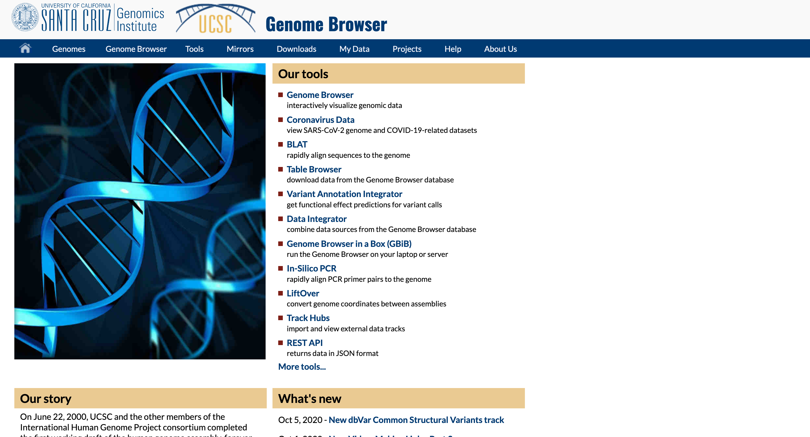
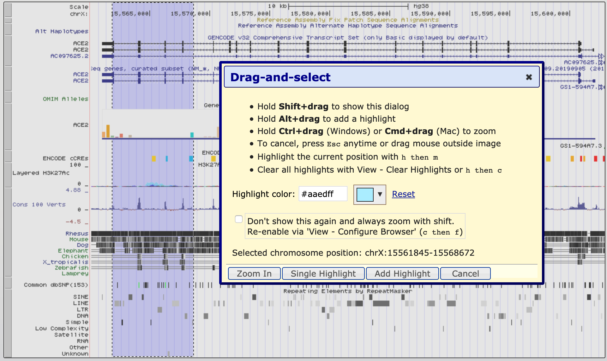
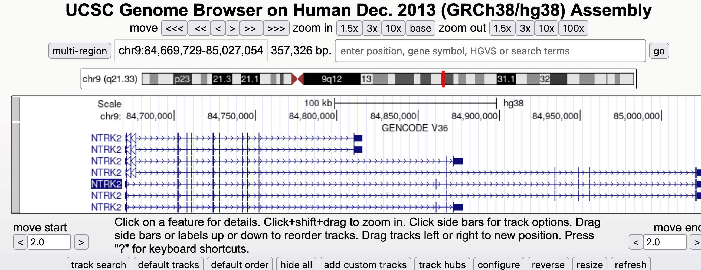
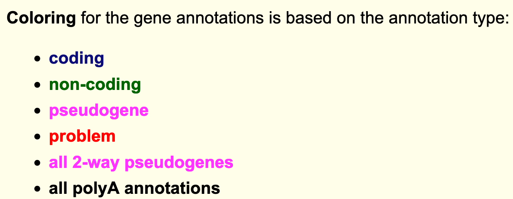
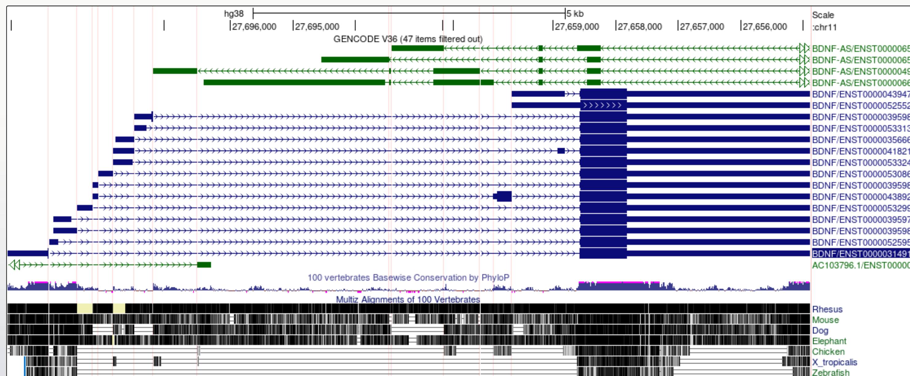
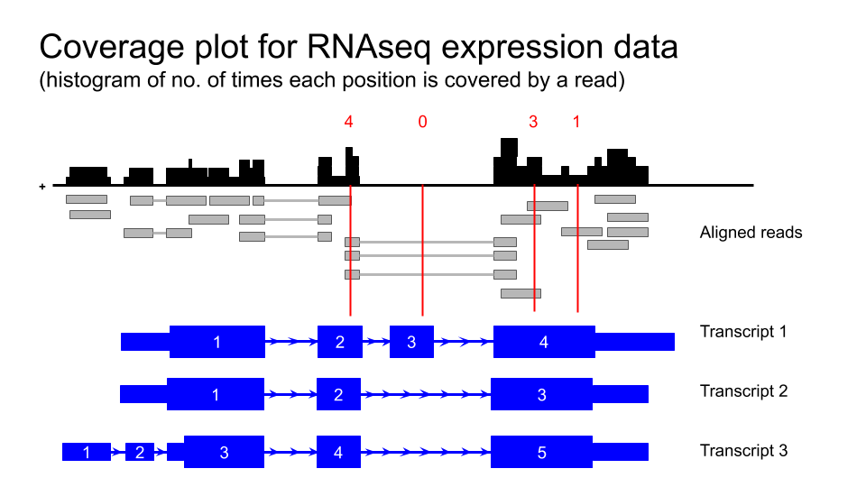
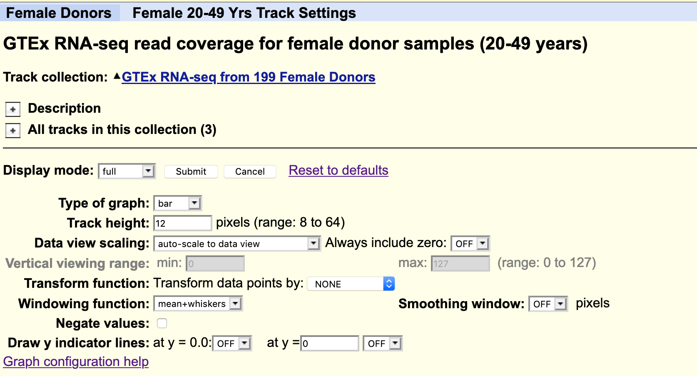
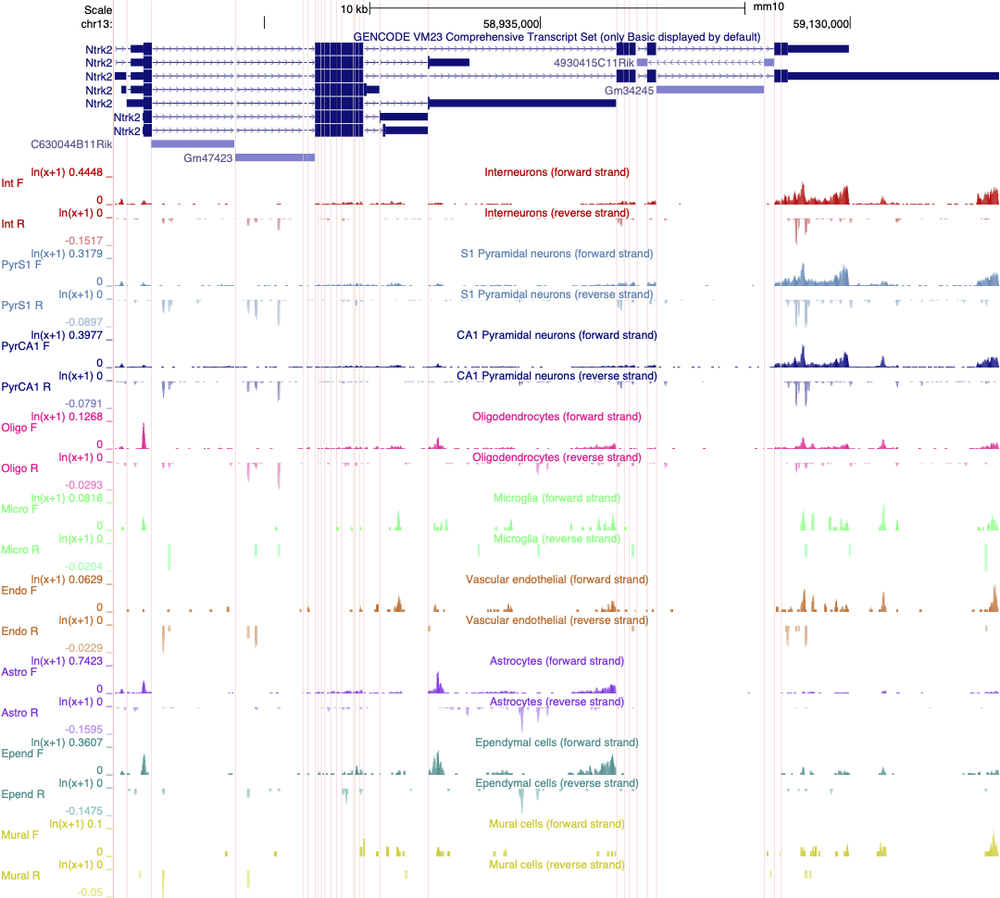
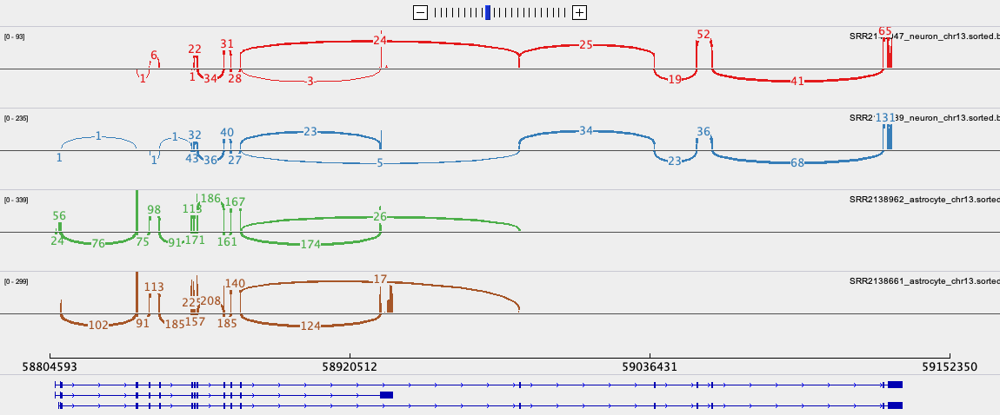

{: style="width:350px; padding-right:50px"}       {: style="width:150px"}

# Introduction to Genome Browsers

Anticipated workshop duration when delivered to a group of participants is **4 hours**.  
Note that not all the exercises are expected to be completed during the workshop.  

For queries relating to this workshop, contact Melbourne Bioinformatics at:  
bioinformatics-training@unimelb.edu.au.

## Overview
This tutorial will introduce you to the genome browser format and illustrate how some freely available genome browsers can be used to interrogate a variety of data types, such as gene expression, genomic variation, methylation and many more.

### Topic

* [x] Genomics
* [x] Transcriptomics
* [ ] Proteomics
* [ ] Metabolomics
* [ ] Statistics and visualisation
* [ ] Structural Modelling
* [x] Basic skills

### Skill level

* [x] Beginner  
* [ ] Intermediate  
* [ ] Advanced  

This workshop is designed for participants with no previous experience of using Genome Browsers and no programming experience.

## Description

*Learn how to make the most of Genome Browsers!*

By focusing on gene expression, this hands on tutorial will provide beginners with an introduction to both the UCSC Genome browser and IGV (Integrated Genome Viewer).  Tools and public datasets will be used to illustrate how the expression of transcript variants can be investigated in different, tissues and cell types using public data, including human RNAseq data from GTEX and mouse cell type RNAseq data from Tabula Muris, as viewed within the UCSC genome browser. A subset of Single cell RNAseq data from the Allen Brain Atlas Celltax study will also be downloaded from SRA and visualised in IGV.
The data and genes used in this workshop are taken from the neuroscience field, however the analysis approaches and tools illustrated can be applied to many research areas.

 
This tutorial is in three parts:

*Section 1:* Introduction to the general features of genome browsers.  
*Section 2:* Hands on tutorial of the [UCSC Genome Browser](https://genome.ucsc.edu/).  
*Section 3:* Hands on tutorials of the [Integrative Genomics Viewer](https://software.broadinstitute.org/software/igv/home).  

This tutorial was developed for use as part a series of workshops for neuroscience researchers, hence the data and example genes are drawn from neuroscience field and focused on analysis and visualisation of expression data. However, the skills taught in this tutorial are applicable to all areas of research.

**Data:** [GTEX](https://gtexportal.org/home/) and [Tabular Muris](https://tabula-muris.ds.czbiohub.org/) data as represented in the UCSC Genome Browser, and [Celltax single cell expression atlas data](http://casestudies.brain-map.org/celltax) downloaded from [SRA](https://www.ncbi.nlm.nih.gov/sra).  

**Tools:** [UCSC Genome Browser](https://genome.ucsc.edu/), [Integrative Genomics Viewer (IGV)](https://software.broadinstitute.org/software/igv/home).

-------------------------------
## Learning Objectives

At the end of this introductory workshop, you will:

* Understand the how some types of genomics and expression data are represented in Genome browsers.
* Understand gene models and identify differences between transcripts variants.
* Determine the tissue/cell type expression profiles of a gene of interest in mouse and human expression data.
* Know some basic files types used in Genome browsers and upload and view local BAM files.
* Use the 'Blat' tool to locate genomic regions with similarity to a sequence of interest.
* Create custom interactive views with multiple datatypes to share with colleagues and generate images for publications.

-------------------------------
## Requirements and preparation

**Attendees are required to provide their own laptop computers.**  

If delivered as a workshop, participants should install the software and data files below prior to the workshop. Ensure that you provide sufficient time to liaise with your own IT support should you encounter any IT problems with installing software. Unless stated otherwise, recommended browsers are Firefox or Chrome.

### Preparing you and your laptop prior to starting this workshop

#### Required software:

1. Download and install [IGV](https://software.broadinstitute.org/software/igv/download) (Free).
2. Ensure that [Chrome](https://www.google.com/chrome/) or [FireFox](https://www.mozilla.org/en-US/) are installed and up-to-date.
3. Create a user account in the [UCSC genome browser](https://genome.ucsc.edu/).

#### Required Data

No additional data needs to be downloaded prior to this workshop. Required data will be downloaded as part of the tutorial exercises.

-------------------------------

### Mode of Delivery

This workshop will be run using freely available Web interfaces and free software using graphical user interfaces. See above.

-------------------------------
## Author(s) and review date
**Written by:** Victoria Perreau | Melbourne Bioinformatics, University of Melbourne.  

**Created:** October 2020  
**Reviewed and revised:** June 2021  

-------------------------------
## Background

### Genome Browser background

Genome browsers are invaluable for viewing and interpreting the many different types of data that can be anchored to genomic positions. These include variation, transcription, the many types regulatory data such as methylation and transcription factor binding, and disease associations. The larger genome browsers serve as data archives for valuable public datasets facilitating visualisation and analysis of different data types. It is also possible to load your own data into some of the public genome browsers.

By enabling viewing of one type of data in the context of another, the use of Genome browsers can reveal important information about gene regulation in both normal development and disease, assist hypothesis development relating to genotype phenotype relationships.

All researchers are therefore encouraged to become familiar with the use of some of the main browsers such as:

* [The UCSC Genome Browser](https://genome.ucsc.edu/) (RRID:SCR_005780)
* [ESEMBL Genome Browser](https://www.ensembl.org/index.html) (RRID:SCR_013367)
* [Epigenome browser at WashU](https://epigenomegateway.wustl.edu/browser/) (RRID:SCR_006208)
* [Integrative Genomics Viewer (IGV)](http://software.broadinstitute.org/software/igv/) (RRID:SCR_011793)

They are designed for use by researchers without programming experience and the developers often provide extensive tutorials and cases studies demonstrating the myriad of ways in which data can be loaded and interpreted to assist in develop and supporting your research hypothesis.

Many large genomic projects also incorporate genome browsers into their web portals to enable users to easily search and view the data. These include:

* [GTEx](https://gtexportal.org/home/)
* [gnomAD](https://gnomad.broadinstitute.org/)

### BDNF and TrkB signalling

This tutorial uses the a well known and important signalling pathway in the central nervous system (CNS) to illustrate some of the Genome browser tools and utility.

{: align=left }  

Brain Derived Neurotrophic factor (BDNF) protein is an important neurotrophin responsible for regulating many aspects of growth and development in different cells within the CNS. TrkB is an important receptor that binds extracellular BDNF and propagates the intracellular signalling response via a tyrosine kinase. This TrkB receptor protein is encoded by the NTRK2 gene.  

The NRK2 gene expresses a number of different transcript variants in different cell types. The most well studied of these is the full length TrkB receptor referred to as TrkB, which is mainly expressed in neuronal cell types. The other transcript variants all express the same exons encoding the extracellular domain of the receptor (shown in the fugure here in green) but have truncated intracellular domains, which do not include the tyrosine kinase domain and thus activate different signalling pathways upon binding to BDNF.  None of these truncated protein products have been well studied, but the most highly expressed receptor variant is known as TrkB-T1, and is known to be highly expressed in astocytes.  

Since the transcript variants are differently expressed in different cell types within the CNS the NTRK2 gene is a very useful example for exploring cell type specific transcript expression in available public data.

 
**Major CNS cell types:**

{: align=left }  

  

* Neuron (yellow cell in the image)
* Astrocyte  
* Oligodendrocyte  
* Microglia  
* Ependymal  

     

-------------------------------

## Section 1: Introduction to Genome Browsers

Genome browsers rely on a common reference genome for each species in order to map data from different sources to the correct location. A consortium has agreed on a common numbering for each position on the genome for each species. However, this position will vary based on the version of the genome, as error correction and updates can change the numbering. Therefore it is very important to know which version of the genome your data of interest is aligned to.

The sequence for the human reference genome was accumulated up over many years from sequence data from many different sources and does not represent the sequence of one single person. Instead it is a composite of fragments of the genome from many different people.  Also, unlike the human genome which is diploid, the human genome is haploid.  That is there is only one copy of each chromosome. It therefore does not reflect the variation on the population, or even the most common variants in the human genome. Exploring variation within human genome is very important and facilitated by genome browsers but not covered in this workshop.

!!! info "**Genome Build version number - further reading**"
    * [The Genome reference consortium](https://www.ncbi.nlm.nih.gov/grc)  
    * [What does the nomenclature mean?](https://genome.ucsc.edu/FAQ/FAQreleases.html)

    For further info on Human Genome version updates I recommend you look at the updates and [blog pages on the UCSC genome browser](https://genome.ucsc.edu/goldenPath/newsarch.html#2019).

-------------------------------
## Section 2: The UCSC Genome Browser Interface

In this section we will become familiar with the web interface of the UCSC genome browser and explore some of the tools and public datasets available.

* Explore features of particular chromosomal regions
* Investigate specific genes as well as collections of genes
* Search for locations of sequences and markers
* Retrieve annotation information for specific regions or genome-wide
* View your own data in context of other annotations
* Compare a region of one genome to genomes of other species

Weekly maintenance of the browser is at 5-6 pm Thursdays Pacific time, which is equivalent to 11am-12pm AEST time. During this time the browser may be down for a few minutes. To ensure uninterrupted browser services for your research during UCSC server maintenance and power outages, bookmark one of the mirror sites that replicates the UCSC genome browser.

**Accessing the tools**:
Many of the tools that we will explore can be selected via multiple different routes within the browser interface. One way to access many tools is via from the top toolbar on a pull down list, other tools can be accessed from within the browser window.  In the following instructions a series of <ss>blue boxes</ss> is used to indicate successive lower levels from the pull down menu when starting with the top toolbar.  For example, the notation below indicates that you should select 'Genome Browser' from the top tool bar and then click on 'Reset all user settings'.

<ss>Toolbar</ss> <ss>Genome Browser</ss> <ss>Reset all user settings</ss>

**Accessing help and training**:
The UCSC genome browser is supported by a rich training resource which has new material added regularly to the [YouTube channel](https://www.youtube.com/channel/UCQnUJepyNOw0p8s2otX4RYQ/videos). To access training and develop your skills further go to:
<ss>Toolbar</ss>  <ss>Help</ss> <ss>Training</ss>

### Getting started
1. **Open the Browser interface:**  
    * Navigate to the [UCSC genome Browser](https://genome.ucsc.edu/) and sign in if you have an account. 
  
2. **First reset the browser, so that we all see the same screen:**  
    <ss>Toolbar</ss> <ss>Genome Browser</ss> <ss>Reset all user settings</ss>  
3. **Select and open the human Genome Hg38 at the default position, there are a few different ways to do this**  
    * <ss>Toolbar</ss> <ss>Genomes</ss> (this takes you to the Genome gateway page)  
        * Check that GRCh38 is selected in 'human assembly' and click on the blue <ss>GO</ss> box  
    * <ss>Toolbar</ss> <ss>Genomes</ss> <ss>Human GRCh38hg38</ss> (takes you directly to the genome)

    You should see a view of the browser similar to the image below, opening at a position on the X chromosome of Human genome version GRCh38 showing the gene model for the ACE2 gene. Some of the default tracks may have been updated since this screen shot was made. 

4. **Familiarise yourself with the main areas of the interface and locate:**
    * The main Toolbar
    * Blue bar track collections (data of similar types are collected together under the same 'Blue bar' heading). Scroll down to see additional data collections and which ones are turned on as default.
    * Genome species and version number
    * Position box
    * Navigation tool buttons
    * Chromosome ideogram
    * Genome view window
    * Pre loaded tracks, track titles:
        * The grey bars on the left of the genome view can be used for selecting and configuring the tracks.
        * You can change the order of the tracks by dragging these grey bars up and down.
    * Turn tracks on and off:
        * You can hide tracks by right clicking on the grey bar or by turning them off in the Blue bar collections.
        * You have to click on a 'refresh' button for changes to be reflected in the genome view window.
    * View the **configuration page** for one of the tracks.  The configuration page gives you a lot of information about the data track and its colouring. You can open the configuration page for a track by:
        * clicking on the grey bar for the track or,
        * clicking on the track title in the Blue bar collection. More information and options are usually available by selecting the configuration page for a track via the track title in the Blue Bar collections.
    * Select 'resize' button under the genome view to fit the genome view window to your screen

5. **Customise your view by using the 'Configure' tool to change the font size to 12.** Use either method below to open the Configure tool.
    * <ss>Toolbar</ss> <ss>View</ss> <ss>Configure browser</ss> <ss>text size 12</ss> <ss>submit</ss>
    * or start by clicking on the <ss>configure</ss> button below the genome view window.

6. **Practice navigating around the genome view.**
    * move left and right- using both the navigation buttons and your mouse
    * zoom in and out- using navigation buttons
    * zoom in to a region of interest- using **'Drag-and-select'**:
        * using your mouse select a region of interest by clicking the ruler (position track) at the very top of the genome view window.
    * This is also how to access the **'highlight tool'** which you will use in a later exercise to highlight a region of interest.
        * Click on the down arrow next to the highlight colour to select a different colour.

###Understanding the gene models

#### NTRK2
First we are going to familiarise ourselves with the gene model representation of the different transcripts of NTRK2.  

1.  **Navigate to the NTRK2 gene position in GRCh38 and view the gene models**
    * You can navigate to a different region by typing in the position box.
        * If you know the specific location you are interested in type in the location using the format "chr#:1234-1234".
        * If you have a gene of interest you can type in the gene name (eg: NTRK2). Note the autocompleted suggestions that appear when  you start typing.  You can select from one of the suggestions or click <ss>go</ss> and select from a wider range of options.
        * Type (or copy and paste) **NTRK2** or **chr9:84,665,760-85,030,334** into the position box.
    * <ss>Hide all</ss> tracks by selecting the button below the genome view.
    * Turn on only the **Gencode V36** Genemodels in 'full' viewing mode by selecting from the blue bar group labelled 'Genes and Gene predictions'.
    * Turn on the 'Conservation' track to 'full'
        * Don't forget to click <ss>refresh</ss>.
    * When you have navigated to the NTRK2 gene, zoom out until you can view all of the 5' UTRs and 3' UTRs for all transcript variants for this gene. Then drag the view left and right to center (like in Google maps) or 'drag and select' the region to center the gene in the Genome view. You should see something like the image below.

    

    !!! question "Which strand is the gene encoded on / transcribed from? (+ or - strand)"

    * Identify the exons, introns and UTRs  

        !!! question "Do regions of conservation only occur were there are coding regions?"

        !!! question "How many different transcripts variants are there for this gene?"

        !!! question "How do they differ?"

    * Select a coding region (full height boxes) towards the 3'UTR of the gene.
        * zoom in to the region until you can see the letters of the amino acid sequence.

        !!! question "Why are some amino acid boxes red or green?"

        * Zoom in again until you can see each amino acid number.

        !!! question "Why do different transcripts have different amino acid numbers?"

    * Note that one of the transcript names is in white text with a black background, this is the transcript you selected from the autocompleted list or the search results.
    * Change the **'view settings'** for the track. Switch between <ss>dense</ss> <ss>squish</ss> <ss>pack</ss> <ss>full</ss> to see how it changes the representation of the models.
        * Right click on the track grey bar in the left of the genome window to access view settings.
    * Go to the configuration  page for the **GENCODE V36** track and change check the box to also reveal the 'Ensembl ID' in the label.
    * The transcript names are now too long to fit on the screen. You can use the configuration page (like you did to chane the font size at the beginning of the workshop) and change the number of characters in the label so that you can see the entire transcript label.  
    * Test your understanding of gene model representation by attempting this 6 questions in this [quiz](https://forms.gle/AnqR2igkm2xgEqEs6).

#### BDNF
Now we look at the gene model for BDNF in the same genome. There are some differences that enable us to demonstrate some more tools.

1. **Navigate to the BDNF gene position in GRCh38 and view the gene models**

  * Note that there are blue transcript models encoded on the - strand and green BDNS-AS transcript models on the + strand. BDNF-AS is the antisense gene.
  * Colouring info is specific for each trackand can be obtained from the configuration page, below is the colouring legend for the GENCODE V36 track.
  

  * Since the convention is to display genes in the 5' to 3' orientation it can be useful for our own interpretation, and also for presentation purposes, to flip the orientation of a gene when viewing it in a Genome Browser.
    * Use the <ss>reverse</ss> button under the genome view window to flip the orientation of the gene.
  * When a gene has many large introns taking up a lot of white space in an image it can be difficult to see if exons in different transcript models or other data tracks align.  The **'Multi-Region'** view tool can be used to fold the intronic regions out of the view like a concertina. The Broswer selects which region to fold out based on the gene model track(s) that you have turned on at the time.
    * Apply the Multi-Region view from the main tool bar view options.
        * <ss>Toolbar</ss> <ss>View</ss> <ss>Multi-Region</ss> select 'Show exons using GENCODE V36'

It is now a lot easier to view a number of interesting features in the BDNF transcript models:

*  The transcript variants for the BDNF vary mostly in the genomic position of the 5'UTR.
*  The noncoding AS-BDNF gene transcript includes a region that would be antisense to the coding BDNF transcript.

You may find that using the multi-region tool facilitates visualisation and interpretation of gene expression data later in the workshop.

###Blat tool exercise
The [Blat tool](https://genome.ucsc.edu/FAQ/FAQblat.html) is a sequence similarity tool similar to Blast. It can quickly identify region(s) of homology between a genome and a sequence of interest. Due to the presence of [orthologs and paralogs](https://en.wikipedia.org/wiki/Sequence_homology) a target sequence may have similarity to more than one region in the genome. In this exercise you will use Blat to map the sequences of two different expression probes to their target regions and determine which gene transcripts the probes are likely to detect in an expression study.

Microarray expression data is not commonly used now, but some of the data generated from large well orchestrated studies still provide valuable information to researchers. Microarray probes, like *in situ* hybridisation probes, target a small region of the RNA and do not measure the whole RNA transcript. If you are measuring gene expression it is important to know exactly which region of the gene you are detecting.  In this exercise we will employ the blat tool to determine which region of the NTRK2 gene the microarray probes in the following study are detecting.

 The study was [the Human Brain gene expression atlas](http://human.brain-map.org/) generated by the [Allen Institute](https://alleninstitute.org/about/).  Below are sequences of two hybridisation probes that were use in a microarray used to detect expression of the gene NTRK2.
 These two probes result in very different hybridisation and expression patterns across different regions of the brain. As we observed in the exercise above NTRK2 has a number of different transcript variants.  The question we have is whether these probes are detecting different or multiple transcripts of NTRK2, and if so which ones?

***NTRK2 Probe A_23_P216779 sequence:***  
**TTCTATACTCTAATCAGCACTGAATTCAGAGGGTTTGACTTTTTCATCTATAACACAGTG**  

Z score of expression level in Human brain (blue = low expression, red = high expression)

***NTRK2 Probe A_24_P343559 sequence***  
**AAGCTGCTCTCCTTCACTCTGACAGTATTAACATCAAAGACTCCGAGAAGCTCTCGAGGG**  

Z score of expression level in Human brain (blue = low expression, red = high expression)

***The images above are of one of the six donors included in the atlas, and typical of the expression pattern for NTRK2. These images are taken from the [NTRK2 gene page of Human Brain Atlas](http://human.brain-map.org/microarray/gene/show/4884).***

Most obvious in the images above is the high level of expression signal using Probe A_23_P216779 and low level for A_24_P343559 in the corpus callosum (CC) which is a region of white matter in the brain with relatively few neurons and relatively high proportion of myelinating oligodendrocytes. This expression profile is reversed in the the cortical regions, eg. frontal lobe (FL) and parietal lobe (PL), which have a relatively high density of neuronal cells.

1. **Use Blat tool to find region of homology**
    * Select: <ss>Toolbar</ss> <ss>tools</ss> <ss>blat</ss>
    * Copy the sequence of the first probe above and paste into the search box
    * Select the human GRCh38  for 'Assembly' and click <ss>Submit</ss>
        * A_23_P216779 returns 2 hits for different chromosomes.  One of these has 100% homology over the whole 60 base sequence, the other has 87% homology over a 24 base region.
    * Copy and paste the probe name to use as the label for the **'Custom track name'** and **'Custom track description'** and click on <ss>Build a custom track with these results</ss>. It's not necessary to build a custom track, you could simply click on the <ss>browser</ss> link to view the results, but creating a 'custom track' from the blat result enables you to give it a unique name.  This is important if you are doing multiple blat searches as you wont be able to tell which one is which.
    * Select <ss>browser</ss> option for the hit with the highest homology to view the result. Observe which region of the NTRK2 gene this probe will target. Zoom out for context.
    * Repeat for the other probe sequence.

2. **Use the 'highlight' tool to keep track of region of interest in the Genome view** It is easy to loose track of a region you are investigating when navigating around the genome in a browser. So we are going to highlight each region of probe homology within the NTRK2 gene, using a different colour for each probe. Highlight is also useful if you have lots of different tracks loaded and you want to check that a feature on one track lines up with another.
    * Using your mouse select in the position track at the top to activate 'Drag-and-select'. Select only the region of homology for each probe within the NTRK2 gene and use a different highlight for each region. Then zoom out to view the whole gene again.

    !!! question "Do the probes detect coding regions of the NTRK2 gene?"  

    !!! question "Are the probes likely to detect different transcripts?"  

3. **Use 'Multiregion view' to make it easier to compare coding regions of different transcripts**
    * <ss>Toolbar</ss> <ss>View</ss> <ss>Multi-Region</ss> select 'Show exons using GENCODE v32'

**I have created a 'public session' of the Blat NTRK2 exercise you can view it from the link in the sessions**  
<ss>Toolbar</ss> <ss>My data</ss> <ss>Public session</ss> search for **"hg38_NTRK2_blat_probes"**.

###Gene expression data

1. **Human tissue specific expression data from the [GTEX project](https://gtexportal.org/home/) is available in UCSC genome browser**
    * Gene level expression data from GTEx V6 (570) donors, and GTEx V8 (948) donors can be turned on from Blue bar title for more detailed configuration page. These are displayed as coloured bar plots.
    * Transcript level data is also available for GTEx V6, this is also displayed as bar plots.
    * Transcript level expression data for GTEx V6 is available as coverage plots and is accessed from the **'Track hubs'**.
        * click on the white 'track hubs' under the genome view window or access from the toolbar under 'My data'.
        * scroll down and select 'GTEx RNA-seq Signal Hub'.  This can be viewed in either hg19 or hg38 so can be compared with a wide variety of other datasets.

    * The default settings are:
        * that all the available data from one individual is loaded. Other samples from other subjects in the study can be loaded.  For example you could load all available samples for one tissue region only.
        * the data is 'autoscale to data view' with a track height or 12 pixels for each samples. You can change the height of the track or add a transformation.
        * you can also change it from a points plot into a density plot by clicking on the track title.

2. **The FACS derived data from the [Tabular Muris](https://tabula-muris.ds.czbiohub.org/) cell type data can be visualised as a coverage plot**
    * Start at the view of the NTRK2 gene in the human genome and navigate to the Ntrk2 gene in the mouse genome using the 'View in other genomes tool'.
        * <ss>Toolbar</ss> <ss>View</ss> <ss>In Other Genomes</ss> (Convert)
        * select New Genome:Mouse , New Assembly:GRC38/mm10, click on 'Submit'
        * select the region with the greatest homology
    * Configure the Tabular Muris track by selecting it from the blue bar collection.
        * Hide 'Cell expression'
        * Select 'Genome coverage' to full
        * Select 'submit' 
**This can look like a bit too much data to manage as there are very many tracks and the default track height is set very high. But it's easy to simplify it by focusing on cell types of interest.**  
    * Right click on the grey bar to 'configure the track set'.
        * Change track height to 30
        * for 'data view scaling' select group autoscale
        * clear all the subtracks and then manually select only a few cell types of interest:
            *  astrocyte Cv
            * Bergmann glial Cv
            * microglia Cv
            * neuron Cv
            * oligodendrocyte Cv
            * OPC Cv

    !!! question "Which cell type has the highest level expression in this dataset?"

    * Change the 'Data view scaling' to autoscale to dataview.
        * Export a PDF image of the genome view: <ss>Toolbar</ss> <ss>View</ss> <ss>PDF/PS</ss> select 'Download the current browser graphic in PDF'
    

    !!! question "Which cell type(s) express the long and short transcripts for NTRK2?"

3. **Mouse CNS cell type expression data can also be validated using an independent single cell dataset of mouse cortex from the [Linnarsson lab](http://linnarssonlab.org/)**.
    * The data that is publicly available for viewing in the UCCS genome browser but is not housed in the UCSC genome browser. You must first access it from the the Linnarsson lab data page.
    * This RNAseq data is stranded, meaning you can see if the transcript data is from the + or - strand.
    * Go to the [Public data page](http://linnarssonlab.org/cortex/) where you can search for cell expression profiles for individual genes.
    * Click on the 'Browse the genome' blue text near the bottom of the page.
    * This loads 18 different tracks, one for each cell type. The default setting for expression range is quite high and most gene expression cannot be visualised with these settings. Each track must be configured individually rather than as a group, which takes a lot of time. I have created a version of this data as a public session in the UCSC genome browser. Where each track is autoscaled which can make it quicker to determine which expression range would be ideal for visualising the expression of an individual gene.  The data is also viewed using 'Multi-Region' which hides the introns in the gene models. THe sessopn is illustrated in a screen shot below and you can access this custom track set by clicking on the title in blue text.

      **[Linnarsson lab mouse cortex single cell data as autoscaled datatracks](https://genome.ucsc.edu/cgi-bin/hgTracks?db=mm10&lastVirtModeType=exonMostly&lastVirtModeExtraState=&emGeneTable=knownGene&virtModeType=exonMostly&virtMode=1&nonVirtPosition=chr13%3A58807697%2D59133970&position=chr13%3A58807697%2D59133970&hgsid=1130613507_A81QmYr4dhsQBuI4PbXkGTxoEaZH)**

      

    * As an exercise, select 2 or three cell types and adjust the scale to best reflect differences in gene expression of Ntrk2 between these cells. Save this session and share it.

## Section 3: IGV

In this section we will download a BAM file of gene expression data from SRA, and view it in the Integrated Genome Viewer (IGV). BAM files must first be sorted and indexed before they can be loaded into genome viewers and IGV has tools to do this without having to use the command line.

The expression data we are using for this exercise is from the mouse [Celltax single cell expression atlas](http://casestudies.brain-map.org/celltax) published by the Allen Brain Institute. The cell tax vignette has an expression browser that displays gene level expression as a heat map for any gene of interest. The readsets (fastq files) and aligned data (BAM files) for 1809 runs on single cells are also available for download from SRA.

The SRA study ID for this study is [SRP061902](https://www.ncbi.nlm.nih.gov/sra?term=SRP061902) and individual runs from this study are easily selected by viewing the samples in the 'RunSelector'. If you wish to identify particular cell types of interest.  For this exercise I have already identified a few samples that we will download in order to illustrate navigating in IGV by looking at the expression of NTRK2 in the same cell types we have discussed in earlier exercises.  

For each cell type we will down load a .BAM file containing only the reads from the chromosome of interest.

For each SRA run in the table below open the link to the run to down load the data. Not many raw data sets in SRA have aligned data available for down load but this data set does.

| Cell type  | SRA run  | Vignette Cell ID|
| :--------- | :------- |:------- |
| **astrocyte**   | [SRR2138962](https://trace.ncbi.nlm.nih.gov/Traces/sra/sra.cgi?run=SRR2138962)  | D1319_V |
| **astrocyte**   | [SRR2139935](https://trace.ncbi.nlm.nih.gov/Traces/sra/sra.cgi?run=SRR2139935)  | A1643_VL |
| **neuron** | [SRR2139989](https://trace.ncbi.nlm.nih.gov/Traces/sra/sra.cgi?run=SRR2139989)  | S467_V4 |
| **neuron** | [SRR2140047](https://trace.ncbi.nlm.nih.gov/Traces/sra/sra.cgi?run=SRR2140047) | S1282_V |

1. **Download BAM files from SRA**
    * Click on the 'Alignment' tab
    * Note that the data is aligned to the mouse GRCm38 genome (mm10).
    * Select the chromosome of interest. For NTRK2 in mouse it is chr13
    * For 'Output this run in:' select **BAM** and click on 'format to:' **File**
    * Rename the downloaded file to include the cell type, to avoid confusion. eg: **SRR2138661_astrocyte_chr13.bam**

2. **Use IGV tools to SORT and INDEX the BAM files** Store sorted BAM files and index files in the same folder.
    * Open IGV and select Tools / Run igvtools... from the pull town menus.
    * Select **'Sort'** from the Command options and use the brows options to select the BAM file you just downloaded and click **'Run'**
    * Without closing the igvtools window now select the command **'Index'** and Browse to find the BAM file you just sorted.  It will have the same file name with 'sorted' added to the end. eg SRR2138661_astrocyte_chr13.sorted.bam
    * The resulting index file will have the file name : SRR2138661_astrocyte_chr13.sorted.bam.bai
        * It is essential that the index file for a BAM file has the same name and is located in the same folder as its BAM file. If not the IVG software will not be able to open the BAM file. 

        {: style="width:450px"}

3. **View the BAM files in IGV**
    * Select the Mouse (mm10) genome from the genome box in the top right hand corner.
    * Select File / Load from File... and select all 4 '_chr13.sorted.bam' files only (use command to select more then one file at a time).
    * select open - but don't expect to see any data yet. The genome view window opens on a whole chromosome view as default but it wont show any data until the view region is small enough to show all data in the current view.
    * Type the gene name 'NTRK2' into the search window.
    * Expand the Refseq gene model track by right clicking it to see all the splice variants
    * The gene and thus the genome view is 328kb and the default setting for viewing data is only 100kb.  So unless you have already changed your settings alignment data will not get be showing.
    * zoom into the region of a coding exon by selecting in the numbered location track at the top of the genome view.
    * To see the whole gene in the genome window at the same time you may need to change the preferences.  
    * Go to View / Preferences and select the 'Alignments tab'.
    * Change the visibility range threshold to 400kb.

**You may need to change this back to a smaller range in the future if you are working with large datasets and/or small amounts of memory on your computer.**

4. **Export images**
    * The Genome view above can be exported by selecting 'File / Save image...'  from the tool bar.
    * To export the Sashimi plot below:
        * Right click on one of the junction tracks and select 'Sashimi Plot' from the poll down menu.
        * Select the tracks you want in your final image.
        * There are some data filtering and style adjustments you can make to the Sashimi plot. Right click on each track to access the menu options. Some changes apply to each track individually and some to all tracks.

5. **Download and install the Gencode gene model annotation track**
    * The refseq gene model track is not as comprehensive as GeneGode gene models. For both Human and Mouse the Gencode gene model gtf annotaion files can be downloaded form [Gencode](https://www.gencodegenes.org/mouse/). If you wish to do this be aware that it takes a little time and is not  done as part of a workshop.
        * Create a folder called 'annotations/Mouse' in the main 'igv' folder that was installed on your computer when you downloaded IGV.
        * Download the GTF file from the link above and save it in this folder.
        * Unpack and then **SORT** and **INDEX** the .gtf file using igvtools.

        * in IGV, before you load you data files, load this annotation file and it will replace the refseq one.

-------------------------------
## Additional reading

**IGV**  
https://rockefelleruniversity.github.io/IGV_course/presentations/singlepage/IGV.html
