# scRNA-seq Integration and Differential Expression

[**Slides available here.**](./media/seurat-de-slides.pdf)

## Overview

**Topic**

* [ ] Genomics
* [x] Transcriptomics
* [ ] Proteomics
* [ ] Metabolomics
* [ ] Statistics and visualisation
* [ ] Structural Modelling
* [ ] Basic skills


**Skill level**

* [ ] Beginner  
* [x] Intermediate  
* [ ] Advanced  

**Data:** IFNB-Stimulated and Control PBMCs.

**Tools:** R >=4.4.0 and associated packages:

* Seurat  
* SeuratData  
* tidyverse  
* DESeq2  
* patchwork  
* pheatmap  
* grid  
* metap  

**Pipeline:**  
*Section 1:* Setup and Intro.  
*Section 2:* Placeholder.  
*Section 3:* Differential Gene Expression when dealing with two treatment conditions.  
*Section 4:* Differential Expression using a pseudobulk approach and DESeq2.  

**Learning objectives:** Placeholder.

<!-- Remove this if not applicable.>
!!! warning "Disclaimer"
    This tutorial is partially based on some existing material.
-->

<!-- Use this divider between sections -->
---
<!-- Use this divider between sections -->

## Setup
**Install something**  

TO-DO
Tell users what to install. Subsection headers using bold, not the hash character.

!!! success "Well done!"
    Confirm that users are ready to start.


<!-- Use this divider between sections -->
---
<!-- Use this divider between sections -->

## Introduction

### Step 1. Load the packages and data

Today we'll be working with Seurat (a popular scRNA-seq analysis package). SeuratData will be used to load in the experimental data we're analysing. Tidyverse is a fundamental and very popularly used set of tools to wrangle and visualise data.

We'll need to load the DESeq2 R package for when we explore pseudobulk DE approaches

pheatmap and grid are two really useful packages for creating custom heatmaps with our scRNA-seq data and exporting figures, respectively.

```r
library(Seurat)
library(SeuratData)
library(tidyverse)
library(DESeq2)
library(patchwork)
library(pheatmap)
library(grid)
library(metap)

set.seed(4242) #Set Seed for Reproducibility
setwd("/Users/vsalazar/Bio/MB/Seurat_DE_Workshop") ## Change this
```

We're using the ifnb public dataset provided by Seurat. This dataset contains PBMC data from 8 lupus patients before and after interferon beta treatment.

I strongly encourage you to explore the other datasets offered by the SeuratData package, it can be really good practice in your spare time.

The ifnb Seurat object we're loading in here was originally made in Seurat v4, there have since been a lot of changes from Seurat v4 to v5 so we'll use the UpdateSeuratObject() function to update the Seurat object so that it is compatible for today.

!!! question
    Looking at the output from the `str()` function on the ifnb seurat object, can you tell whether this seurat object is processed or unprocessed?

ANSWER: When loading in seurat objects, we can have a look at what processing steps have been performed on it by using the str() function. In the output we can tell that the ifnb Seurat object is unprocessed because:

1)  the scale.data slot is empty

2)  no variable features have been identified

3)  no dimensionality reduction functions have been performed.

```r
AvailableData() # if you want to see the available datasets use this function
```

??? info
    ```output
    ##                                    Dataset Version
    ## adiposeref.SeuratData           adiposeref   1.0.0
    ## bmcite.SeuratData                   bmcite   0.3.0
    ## bonemarrowref.SeuratData     bonemarrowref   1.0.0
    ## cbmc.SeuratData                       cbmc   3.1.4
    ## celegans.embryo.SeuratData celegans.embryo   0.1.0
    ## fetusref.SeuratData               fetusref   1.0.0
    ## hcabm40k.SeuratData               hcabm40k   3.0.0
    ## heartref.SeuratData               heartref   1.0.0
    ## humancortexref.SeuratData   humancortexref   1.0.0
    ## ifnb.SeuratData                       ifnb   3.1.0
    ## kidneyref.SeuratData             kidneyref   1.0.2
    ## lungref.SeuratData                 lungref   2.0.0
    ## mousecortexref.SeuratData   mousecortexref   1.0.0
    ## panc8.SeuratData                     panc8   3.0.2
    ## pancreasref.SeuratData         pancreasref   1.0.0
    ## pbmc3k.SeuratData                   pbmc3k   3.1.4
    ## pbmcMultiome.SeuratData       pbmcMultiome   0.1.4
    ## pbmcref.SeuratData                 pbmcref   1.0.0
    ## pbmcsca.SeuratData                 pbmcsca   3.0.0
    ## ssHippo.SeuratData                 ssHippo   3.1.4
    ## stxBrain.SeuratData               stxBrain   0.1.2
    ## stxKidney.SeuratData             stxKidney   0.1.0
    ## thp1.eccite.SeuratData         thp1.eccite   3.1.5
    ## tonsilref.SeuratData             tonsilref   2.0.0
    ##                                                                                   Summary
    ## adiposeref.SeuratData                                          Azimuth Reference: adipose
    ## bmcite.SeuratData                                                   30k Bone Marrow Cells
    ## bonemarrowref.SeuratData                                    Azimuth Reference: bonemarrow
    ## cbmc.SeuratData                              scRNAseq and 13-antibody sequencing of CBMCs
    ## celegans.embryo.SeuratData         6k C. elegans embryos from Packer and Zhu et al (2019)
    ## fetusref.SeuratData                                              Azimuth Reference: fetus
    ## hcabm40k.SeuratData        40,000 Cells From the Human Cell Atlas ICA Bone Marrow Dataset
    ## heartref.SeuratData                                              Azimuth Reference: heart
    ## humancortexref.SeuratData                                  Azimuth Reference: humancortex
    ## ifnb.SeuratData                                         IFNB-Stimulated and Control PBMCs
    ## kidneyref.SeuratData                                            Azimuth Reference: kidney
    ## lungref.SeuratData                                                Azimuth Reference: lung
    ## mousecortexref.SeuratData                                  Azimuth Reference: mousecortex
    ## panc8.SeuratData                         Eight Pancreas Datasets Across Five Technologies
    ## pancreasref.SeuratData                                        Azimuth Reference: pancreas
    ## pbmc3k.SeuratData                                              3k PBMCs from 10X Genomics
    ## pbmcMultiome.SeuratData                                10X Genomics PBMC Multiome Dataset
    ## pbmcref.SeuratData                                                Azimuth Reference: pbmc
    ## pbmcsca.SeuratData                   Broad Institute PBMC Systematic Comparative Analysis
    ## ssHippo.SeuratData                              Slide-seq v2 dataset of mouse hippocampus
    ## stxBrain.SeuratData                               10X Genomics Visium Mouse Brain Dataset
    ## stxKidney.SeuratData                             10X Genomics Visium Mouse Kidney Dataset
    ## thp1.eccite.SeuratData                                                   ECCITE-seq THP-1
    ## tonsilref.SeuratData                                            Azimuth Reference: tonsil
    ##                               species            system ncells
    ## adiposeref.SeuratData           human           adipose 160075
    ## bmcite.SeuratData               human       bone marrow  30672
    ## bonemarrowref.SeuratData        human        bonemarrow 297627
    ## cbmc.SeuratData                 human CBMC (cord blood)   8617
    ## celegans.embryo.SeuratData C. elegans            embryo   6188
    ## fetusref.SeuratData             human             fetus 377456
    ## hcabm40k.SeuratData             human       bone marrow  40000
    ## heartref.SeuratData             human             heart 656509
    ## humancortexref.SeuratData       human      motor cortex  76533
    ## ifnb.SeuratData                 human              PBMC  13999
    ## kidneyref.SeuratData            human            kidney  64693
    ## lungref.SeuratData              human              lung 584884
    ## mousecortexref.SeuratData       mouse      motor cortex 159738
    ## panc8.SeuratData                human Pancreatic Islets  14892
    ## pancreasref.SeuratData          human          pancreas  35289
    ## pbmc3k.SeuratData               human              PBMC   2700
    ## pbmcMultiome.SeuratData         human              pbmc  11909
    ## pbmcref.SeuratData              human              PBMC   2700
    ## pbmcsca.SeuratData              human              PBMC  31021
    ## ssHippo.SeuratData              mouse       hippocampus     NA
    ## stxBrain.SeuratData             mouse             brain  12167
    ## stxKidney.SeuratData            mouse            kidney   1438
    ## thp1.eccite.SeuratData          human              <NA>     NA
    ## tonsilref.SeuratData            human            tonsil 377963
    ##                                                                                       tech
    ## adiposeref.SeuratData                                               scRNA-seq and sNuc-seq
    ## bmcite.SeuratData                                                                     <NA>
    ## bonemarrowref.SeuratData                                                            10x v2
    ## cbmc.SeuratData                                                                   CITE-seq
    ## celegans.embryo.SeuratData                                                            <NA>
    ## fetusref.SeuratData                                                                   <NA>
    ## hcabm40k.SeuratData                                                                 10x v2
    ## heartref.SeuratData                                                 scRNA-seq and sNuc-seq
    ## humancortexref.SeuratData                                                             <NA>
    ## ifnb.SeuratData                                                                     10x v1
    ## kidneyref.SeuratData                                                             snRNA-seq
    ## lungref.SeuratData                                                                    <NA>
    ## mousecortexref.SeuratData                                                           10x v3
    ## panc8.SeuratData                          SMARTSeq2, Fluidigm C1, CelSeq, CelSeq2, inDrops
    ## pancreasref.SeuratData                                                                <NA>
    ## pbmc3k.SeuratData                                                                   10x v1
    ## pbmcMultiome.SeuratData                                                               <NA>
    ## pbmcref.SeuratData                                                                  10x v1
    ## pbmcsca.SeuratData         10x v2, 10x v3, SMARTSeq2, Seq-Well, inDrops, Drop-seq, CelSeq2
    ## ssHippo.SeuratData                                                             slideseq v2
    ## stxBrain.SeuratData                                                                 visium
    ## stxKidney.SeuratData                                                                visium
    ## thp1.eccite.SeuratData                                                                <NA>
    ## tonsilref.SeuratData                                                             scRNA-seq
    ##                            seurat default.dataset disk.datasets
    ## adiposeref.SeuratData        <NA>            <NA>          <NA>
    ## bmcite.SeuratData           3.2.2            <NA>          <NA>
    ## bonemarrowref.SeuratData     <NA>            <NA>          <NA>
    ## cbmc.SeuratData             3.1.4             raw     processed
    ## celegans.embryo.SeuratData   <NA>             raw          <NA>
    ## fetusref.SeuratData          <NA>            <NA>          <NA>
    ## hcabm40k.SeuratData          <NA>             raw          <NA>
    ## heartref.SeuratData          <NA>            <NA>          <NA>
    ## humancortexref.SeuratData    <NA>            <NA>          <NA>
    ## ifnb.SeuratData              <NA>             raw          <NA>
    ## kidneyref.SeuratData         <NA>            <NA>          <NA>
    ## lungref.SeuratData           <NA>            <NA>          <NA>
    ## mousecortexref.SeuratData    <NA>            <NA>          <NA>
    ## panc8.SeuratData             <NA>             raw          <NA>
    ## pancreasref.SeuratData       <NA>            <NA>          <NA>
    ## pbmc3k.SeuratData           3.1.4             raw          <NA>
    ## pbmcMultiome.SeuratData     4.1.1              NA          <NA>
    ## pbmcref.SeuratData           <NA>            <NA>          <NA>
    ## pbmcsca.SeuratData           <NA>             raw          <NA>
    ## ssHippo.SeuratData           <NA>             raw          <NA>
    ## stxBrain.SeuratData          <NA>              NA          <NA>
    ## stxKidney.SeuratData         <NA>             raw          <NA>
    ## thp1.eccite.SeuratData       <NA>            <NA>          <NA>
    ## tonsilref.SeuratData         <NA>            <NA>          <NA>
    ##                                                          other.datasets
    ## adiposeref.SeuratData                                              <NA>
    ## bmcite.SeuratData                                                  <NA>
    ## bonemarrowref.SeuratData                                           <NA>
    ## cbmc.SeuratData                                                    <NA>
    ## celegans.embryo.SeuratData                                         <NA>
    ## fetusref.SeuratData                                                <NA>
    ## hcabm40k.SeuratData                                                <NA>
    ## heartref.SeuratData                                                <NA>
    ## humancortexref.SeuratData                                          <NA>
    ## ifnb.SeuratData                                               processed
    ## kidneyref.SeuratData                                               <NA>
    ## lungref.SeuratData                                                 <NA>
    ## mousecortexref.SeuratData                                          <NA>
    ## panc8.SeuratData                                                   <NA>
    ## pancreasref.SeuratData                                             <NA>
    ## pbmc3k.SeuratData                                          pbmc3k.final
    ## pbmcMultiome.SeuratData                             pbmc.rna, pbmc.atac
    ## pbmcref.SeuratData                                                 <NA>
    ## pbmcsca.SeuratData                                                 <NA>
    ## ssHippo.SeuratData                                                 <NA>
    ## stxBrain.SeuratData        posterior1, posterior2, anterior1, anterior2
    ## stxKidney.SeuratData                                               <NA>
    ## thp1.eccite.SeuratData                                             <NA>
    ## tonsilref.SeuratData                                               <NA>
    ##                                                                                                notes
    ## adiposeref.SeuratData                                                                           <NA>
    ## bmcite.SeuratData                                                                               <NA>
    ## bonemarrowref.SeuratData                                                                        <NA>
    ## cbmc.SeuratData                                                                                 <NA>
    ## celegans.embryo.SeuratData                                                                      <NA>
    ## fetusref.SeuratData                                                                             <NA>
    ## hcabm40k.SeuratData                                                                             <NA>
    ## heartref.SeuratData                                                                             <NA>
    ## humancortexref.SeuratData                                                                       <NA>
    ## ifnb.SeuratData                                                                                 <NA>
    ## kidneyref.SeuratData                                                                            <NA>
    ## lungref.SeuratData                                                                              <NA>
    ## mousecortexref.SeuratData                                                                       <NA>
    ## panc8.SeuratData                                                                                <NA>
    ## pancreasref.SeuratData                                                                          <NA>
    ## pbmc3k.SeuratData                                                                               <NA>
    ## pbmcMultiome.SeuratData                                 One sample with two modalities, RNA and ATAC
    ## pbmcref.SeuratData                                                                              <NA>
    ## pbmcsca.SeuratData                                                                     HCA benchmark
    ## ssHippo.SeuratData                                                                              <NA>
    ## stxBrain.SeuratData        One sample split across four datasets as paired anterior/posterior slices
    ## stxKidney.SeuratData                                                                            <NA>
    ## thp1.eccite.SeuratData                                                                          <NA>
    ## tonsilref.SeuratData                                                                            <NA>
    ##                            Installed InstalledVersion
    ## adiposeref.SeuratData          FALSE             <NA>
    ## bmcite.SeuratData              FALSE             <NA>
    ## bonemarrowref.SeuratData       FALSE             <NA>
    ## cbmc.SeuratData                FALSE             <NA>
    ## celegans.embryo.SeuratData     FALSE             <NA>
    ## fetusref.SeuratData            FALSE             <NA>
    ## hcabm40k.SeuratData            FALSE             <NA>
    ## heartref.SeuratData            FALSE             <NA>
    ## humancortexref.SeuratData      FALSE             <NA>
    ## ifnb.SeuratData                 TRUE            3.1.0
    ## kidneyref.SeuratData           FALSE             <NA>
    ## lungref.SeuratData             FALSE             <NA>
    ## mousecortexref.SeuratData      FALSE             <NA>
    ## panc8.SeuratData               FALSE             <NA>
    ## pancreasref.SeuratData         FALSE             <NA>
    ## pbmc3k.SeuratData              FALSE             <NA>
    ## pbmcMultiome.SeuratData        FALSE             <NA>
    ## pbmcref.SeuratData             FALSE             <NA>
    ## pbmcsca.SeuratData             FALSE             <NA>
    ## ssHippo.SeuratData             FALSE             <NA>
    ## stxBrain.SeuratData            FALSE             <NA>
    ## stxKidney.SeuratData           FALSE             <NA>
    ## thp1.eccite.SeuratData         FALSE             <NA>
    ## tonsilref.SeuratData           FALSE             <NA>
    ```


```r
InstallData("ifnb") # install our treatment vs control dataset for today

data("ifnb") # Load the dataset into our current R script
ifnb <- UpdateSeuratObject(ifnb) # Make sure the seurat object is in the format of Seurat v5


str(ifnb) # we can use this to take a look at the information in our Seurat Object, we know that this is an unprocessed Seurat object because the scale.data slot is empty, no variable features identified, no reductions performed..etc
```

??? info
    ```output
    ## Formal class 'Seurat' [package "SeuratObject"] with 13 slots
    ##   ..@ assays      :List of 1
    ##   .. ..$ RNA:Formal class 'Assay' [package "SeuratObject"] with 8 slots
    ##   .. .. .. ..@ counts       :Formal class 'dgCMatrix' [package "Matrix"] with 6 slots
    ##   .. .. .. .. .. ..@ i       : int [1:9787436] 20 27 37 64 65 83 87 131 139 175 ...
    ##   .. .. .. .. .. ..@ p       : int [1:14000] 0 877 1590 2440 3549 4183 4740 5720 6301 7181 ...
    ##   .. .. .. .. .. ..@ Dim     : int [1:2] 14053 13999
    ##   .. .. .. .. .. ..@ Dimnames:List of 2
    ##   .. .. .. .. .. .. ..$ : chr [1:14053] "AL627309.1" "RP11-206L10.2" "LINC00115" "NOC2L" ...
    ##   .. .. .. .. .. .. ..$ : chr [1:13999] "AAACATACATTTCC.1" "AAACATACCAGAAA.1" "AAACATACCTCGCT.1" "AAACATACCTGGTA.1" ...
    ##   .. .. .. .. .. ..@ x       : num [1:9787436] 1 1 1 1 1 2 1 1 1 1 ...
    ##   .. .. .. .. .. ..@ factors : list()
    ##   .. .. .. ..@ data         :Formal class 'dgCMatrix' [package "Matrix"] with 6 slots
    ##   .. .. .. .. .. ..@ i       : int [1:9787436] 20 27 37 64 65 83 87 131 139 175 ...
    ##   .. .. .. .. .. ..@ p       : int [1:14000] 0 877 1590 2440 3549 4183 4740 5720 6301 7181 ...
    ##   .. .. .. .. .. ..@ Dim     : int [1:2] 14053 13999
    ##   .. .. .. .. .. ..@ Dimnames:List of 2
    ##   .. .. .. .. .. .. ..$ : chr [1:14053] "AL627309.1" "RP11-206L10.2" "LINC00115" "NOC2L" ...
    ##   .. .. .. .. .. .. ..$ : chr [1:13999] "AAACATACATTTCC.1" "AAACATACCAGAAA.1" "AAACATACCTCGCT.1" "AAACATACCTGGTA.1" ...
    ##   .. .. .. .. .. ..@ x       : num [1:9787436] 1 1 1 1 1 2 1 1 1 1 ...
    ##   .. .. .. .. .. ..@ factors : list()
    ##   .. .. .. ..@ scale.data   : num[0 , 0 ] 
    ##   .. .. .. ..@ assay.orig   : NULL
    ##   .. .. .. ..@ var.features : chr(0) 
    ##   .. .. .. ..@ meta.features:'data.frame':   14053 obs. of  0 variables
    ##   .. .. .. ..@ misc         : NULL
    ##   .. .. .. ..@ key          : chr "rna_"
    ##   ..@ meta.data   :'data.frame': 13999 obs. of  5 variables:
    ##   .. ..$ orig.ident        : chr [1:13999] "IMMUNE_CTRL" "IMMUNE_CTRL" "IMMUNE_CTRL" "IMMUNE_CTRL" ...
    ##   .. ..$ nCount_RNA        : num [1:13999] 3017 2481 3420 3156 1868 ...
    ##   .. ..$ nFeature_RNA      : int [1:13999] 877 713 850 1109 634 557 980 581 880 669 ...
    ##   .. ..$ stim              : chr [1:13999] "CTRL" "CTRL" "CTRL" "CTRL" ...
    ##   .. ..$ seurat_annotations: Factor w/ 13 levels "CD14 Mono","CD4 Naive T",..: 1 1 1 12 3 1 7 2 6 1 ...
    ##   ..@ active.assay: chr "RNA"
    ##   ..@ active.ident: Factor w/ 2 levels "IMMUNE_CTRL",..: 1 1 1 1 1 1 1 1 1 1 ...
    ##   .. ..- attr(*, "names")= chr [1:13999] "AAACATACATTTCC.1" "AAACATACCAGAAA.1" "AAACATACCTCGCT.1" "AAACATACCTGGTA.1" ...
    ##   ..@ graphs      : list()
    ##   ..@ neighbors   : list()
    ##   ..@ reductions  : list()
    ##   ..@ images      : list()
    ##   ..@ project.name: chr "ifnb"
    ##   ..@ misc        : list()
    ##   ..@ version     :Classes 'package_version', 'numeric_version'  hidden list of 1
    ##   .. ..$ : int [1:3] 5 0 2
    ##   ..@ commands    : list()
    ##   ..@ tools       : list()
    ```


### Step 2: Run QC, filter out low quality cells

Lets start by processing our data (run the standard seurat workflow steps including preprocessing and filtering).

First we need to take a look at QC metrics, then decide on the thresholds for filtering.

!!! question 
    Looking <!-- TO-DO: complete this-->

```r
# Step 2a: QC and filtering
ifnb$percent.mt <- PercentageFeatureSet(object = ifnb, pattern = "^MT-") # First let's annotate the mitochondrial percentage for each cell

View(ifnb@meta.data) # we can take a look mitochondrial percentages for the seurat object by viewing the seurat objects metadata

# Step 2b: Visualise QC metrics and identify filtering thresholds
qc.metric.plts <- VlnPlot(ifnb, features = c("nFeature_RNA", "nCount_RNA", "percent.mt"), ncol = 3) + 
  ggtitle("Before Filtering")

association.plt.raw <- FeatureScatter(ifnb, feature1 = "nCount_RNA", feature2 = "nFeature_RNA") + geom_smooth(method = "lm") +
  ggtitle("Before Filtering")

qc.metric.plts
association.plt.raw
```

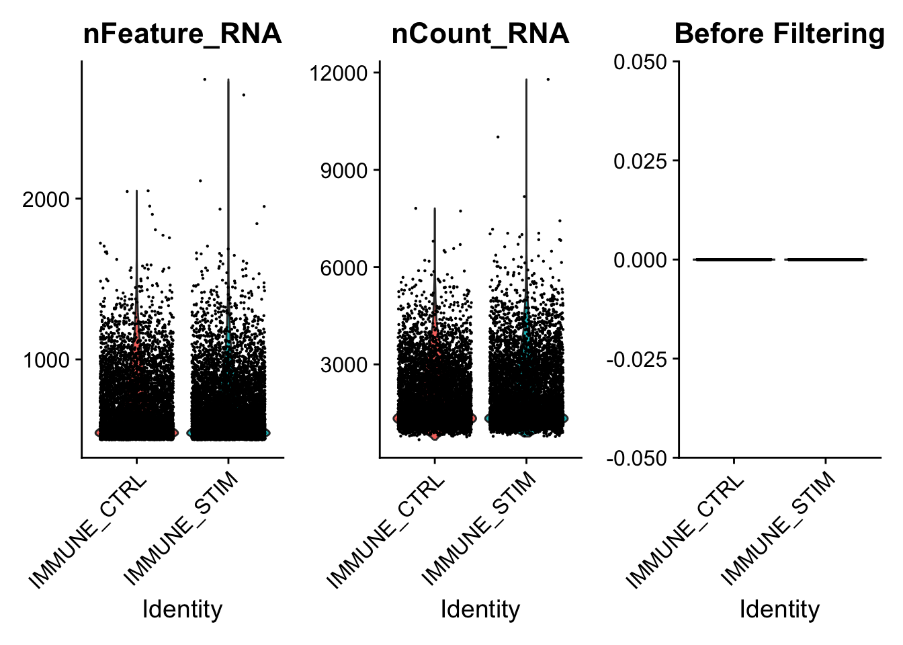
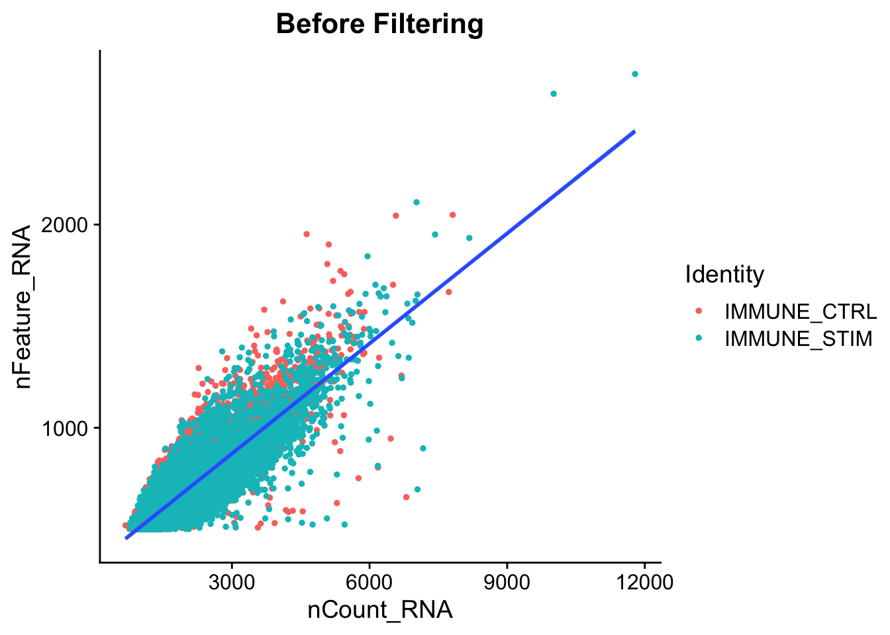

After visualising QC metrics, we'll move on to the actual filtering

```r
# Step 2c: filter out low-quality cells + visualise the metrics for our filtered seurat object
ifnb.filtered <- subset(ifnb, subset = nCount_RNA > 800 & 
                          nCount_RNA < 5000 &
                          nFeature_RNA > 200 &
                          nFeature_RNA < 1200 &
                          percent.mt < 5)

qc.metric.plts.filtered <- VlnPlot(ifnb.filtered, features = c("nFeature_RNA", "nCount_RNA", "percent.mt"), ncol = 3) +
  ggtitle("After Filtering")
association.plt.filtered <- FeatureScatter(ifnb.filtered, feature1 = "nCount_RNA", feature2 = "nFeature_RNA") + geom_smooth(method = "lm") +
  ggtitle("After Filtering")

qc.metric.plts.filtered
association.plt.filtered
```

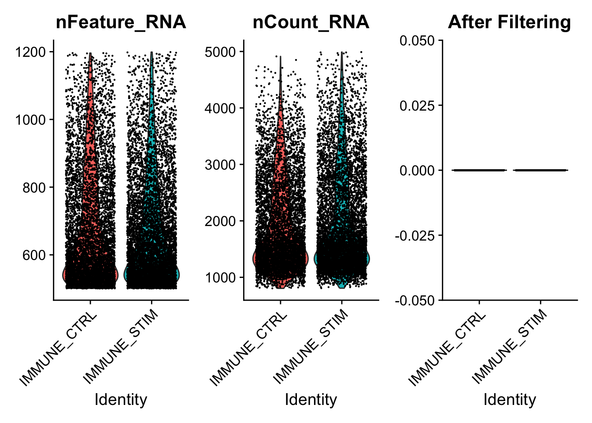
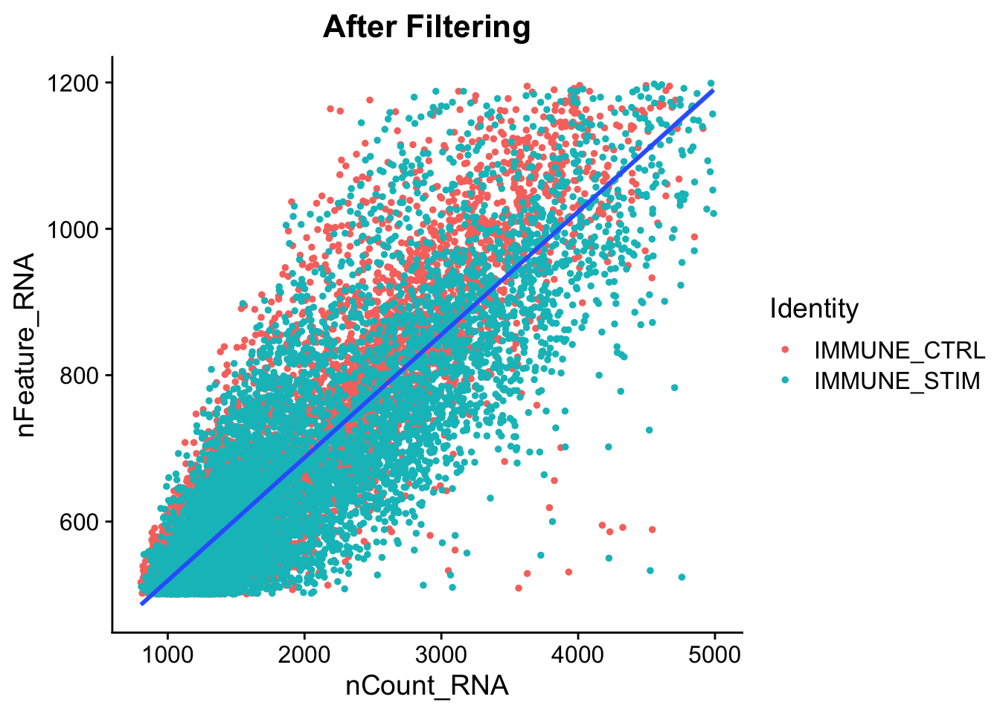


Let's check how many cells we've filtered out (looks like \~400 cells were removed):

```r
## Defining a couple helper functions to standardise x and y axis for two plots
get_plot_range <- function(plot) {
  data <- layer_data(plot)
  list(
    x = range(data$x, na.rm = TRUE),
    y = range(data$y, na.rm = TRUE)
  )
}
standardise_plt_scale <- function(plt1, plt2){

  # Get ranges for both plots
  range_raw <- get_plot_range(plt1)
  range_filtered <- get_plot_range(plt2)
  
  # Calculate overall range
  x_range <- range(c(range_raw$x, range_filtered$x))
  y_range <- range(c(range_raw$y, range_filtered$y))
  
  suppressMessages({
  # Update both plots with the same x and y scales
  association.plt.raw <- association.plt.raw +
    scale_x_continuous(limits = x_range) +
    scale_y_continuous(limits = y_range)
  
  association.plt.filtered <- association.plt.filtered +
    scale_x_continuous(limits = x_range) +
    scale_y_continuous(limits = y_range)
  })
  
  # Wrap the plots
  wrapped_plots <- wrap_plots(list(association.plt.raw, association.plt.filtered), 
                              ncol = 2)

  return(wrapped_plots)
}

wrap_plots(list(qc.metric.plts, qc.metric.plts.filtered), 
           ncol = 1)
```

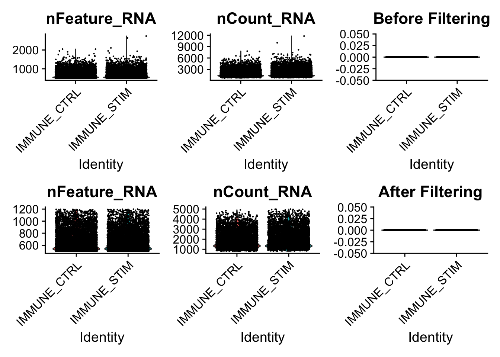

```r
association.plts <- standardise_plt_scale(association.plt.raw,
                                          association.plt.filtered)
association.plts
```
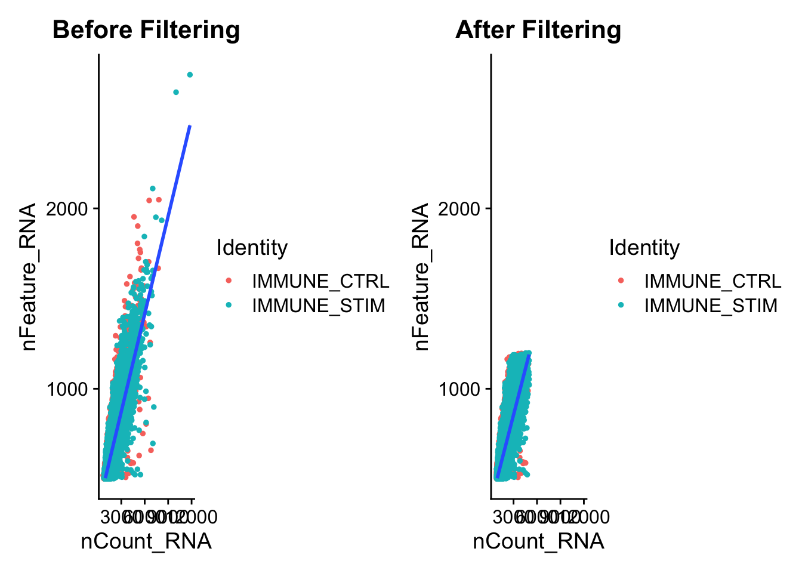

```r
ifnb
```
```output
## An object of class Seurat 
## 14053 features across 13999 samples within 1 assay 
## Active assay: RNA (14053 features, 0 variable features)
##  2 layers present: counts, data
```
```r
ifnb.filtered
```
```output
## An object of class Seurat 
## 14053 features across 13548 samples within 1 assay 
## Active assay: RNA (14053 features, 0 variable features)
##  2 layers present: counts, data
```
```r
ifnb.filtered[["RNA"]] <- split(ifnb.filtered[["RNA"]], f = ifnb.filtered$stim) # Lets split our count matrices based on conditions (stored within different layers) -> needed for integration steps in Seurat v5
```

### Step 3: Before performing differential expression between the two conditions, let's assess whether we need to integrate our data

After filtering out low quality cells, we want to visualise our data to see how cells group by condition and if we need to perform batch-effect correction (integration)

```r
ifnb.filtered <- NormalizeData(ifnb.filtered)

## Normalizing layer: counts.CTRL
## Normalizing layer: counts.STIM

ifnb.filtered <- FindVariableFeatures(ifnb.filtered)

## Finding variable features for layer counts.CTRL
## Finding variable features for layer counts.STIM

ifnb.filtered <- ScaleData(ifnb.filtered)

## Centering and scaling data matrix

ifnb.filtered <- RunPCA(ifnb.filtered)

## PC_ 1 
## Positive:  TYROBP, C15orf48, FCER1G, CST3, SOD2, ANXA5, FTL, TYMP, TIMP1, CD63 
##     LGALS1, CTSB, S100A4, KYNU, LGALS3, FCN1, PSAP, NPC2, ANXA2, IGSF6 
##     S100A11, LYZ, SPI1, APOBEC3A, CD68, CTSL, NINJ1, HLA-DRA, CCL2, SDCBP 
## Negative:  NPM1, CCR7, CXCR4, GIMAP7, LTB, CD3D, CD7, SELL, TMSB4X, CD2 
##     TRAT1, IL7R, PTPRCAP, IL32, ITM2A, RGCC, LEF1, CD3G, ALOX5AP, CREM 
##     PASK, MYC, SNHG8, TSC22D3, BIRC3, GPR171, NOP58, CD27, RARRES3, CD8B 
## PC_ 2 
## Positive:  ISG15, ISG20, IFIT3, IFIT1, LY6E, TNFSF10, IFIT2, MX1, IFI6, RSAD2 
##     CXCL10, OAS1, CXCL11, IFITM3, MT2A, OASL, TNFSF13B, IDO1, IL1RN, APOBEC3A 
##     CCL8, GBP1, HERC5, FAM26F, GBP4, RABGAP1L, HES4, WARS, VAMP5, DEFB1 
## Negative:  IL8, CLEC5A, CD14, VCAN, S100A8, IER3, MARCKSL1, IL1B, PID1, CD9 
##     GPX1, INSIG1, PHLDA1, PLAUR, PPIF, THBS1, OSM, SLC7A11, CTB-61M7.2, GAPDH 
##     LIMS1, S100A9, GAPT, ACTB, CXCL3, C19orf59, MGST1, OLR1, CEBPB, FTH1 
## PC_ 3 
## Positive:  HLA-DQA1, CD83, HLA-DQB1, CD74, HLA-DRA, HLA-DPA1, HLA-DRB1, CD79A, HLA-DPB1, IRF8 
##     MS4A1, SYNGR2, MIR155HG, HERPUD1, REL, HSP90AB1, ID3, HLA-DMA, TVP23A, FABP5 
##     NME1, HSPE1, PMAIP1, BANK1, CD70, HSPD1, TSPAN13, EBI3, TCF4, CCR7 
## Negative:  ANXA1, GNLY, NKG7, GIMAP7, TMSB4X, PRF1, CD7, CCL5, RARRES3, CD3D 
##     CD2, KLRD1, GZMH, GZMA, CTSW, GZMB, FGFBP2, CLIC3, IL32, MT2A 
##     FASLG, KLRC1, CST7, RGCC, CD8A, GCHFR, OASL, GZMM, CXCR3, KLRB1 
## PC_ 4 
## Positive:  LTB, SELL, CCR7, LEF1, IL7R, CD3D, TRAT1, GIMAP7, ADTRP, PASK 
##     CD3G, TSHZ2, CMTM8, SOCS3, TSC22D3, NPM1, CCL2, MYC, CCL7, CCL8 
##     CTSL, SNHG8, TXNIP, CD27, S100A9, CA6, C12orf57, TMEM204, HPSE, GPR171 
## Negative:  NKG7, GZMB, GNLY, CST7, PRF1, CCL5, CLIC3, KLRD1, APOBEC3G, GZMH 
##     GZMA, CTSW, FGFBP2, KLRC1, FASLG, C1orf21, HOPX, SH2D1B, TNFRSF18, CXCR3 
##     LINC00996, SPON2, RAMP1, ID2, GCHFR, IGFBP7, HLA-DPA1, CD74, XCL2, HLA-DPB1 
## PC_ 5 
## Positive:  CCL2, CCL7, CCL8, PLA2G7, TXN, LMNA, SDS, S100A9, CSTB, ATP6V1F 
##     CAPG, CCR1, EMP1, FABP5, CCR5, IDO1, TPM4, LILRB4, MGST1, CTSB 
##     HPSE, CCNA1, GCLM, PDE4DIP, HSPA1A, CD63, SLC7A11, HSPA5, VIM, HSP90B1 
## Negative:  VMO1, FCGR3A, MS4A4A, CXCL16, MS4A7, PPM1N, HN1, LST1, SMPDL3A, ATP1B3 
##     CASP5, CDKN1C, AIF1, CH25H, PLAC8, SERPINA1, TMSB4X, LRRC25, CD86, GBP5 
##     HCAR3, RP11-290F20.3, COTL1, RGS19, VNN2, PILRA, STXBP2, LILRA5, C3AR1, FCGR3B


ElbowPlot(ifnb.filtered) # Visualise the dimensionality of the data, looks like 15 PCs is adequate to capture the majority of the variation in the data, but we'll air on the higher side and consider all 20 dimensions.
```
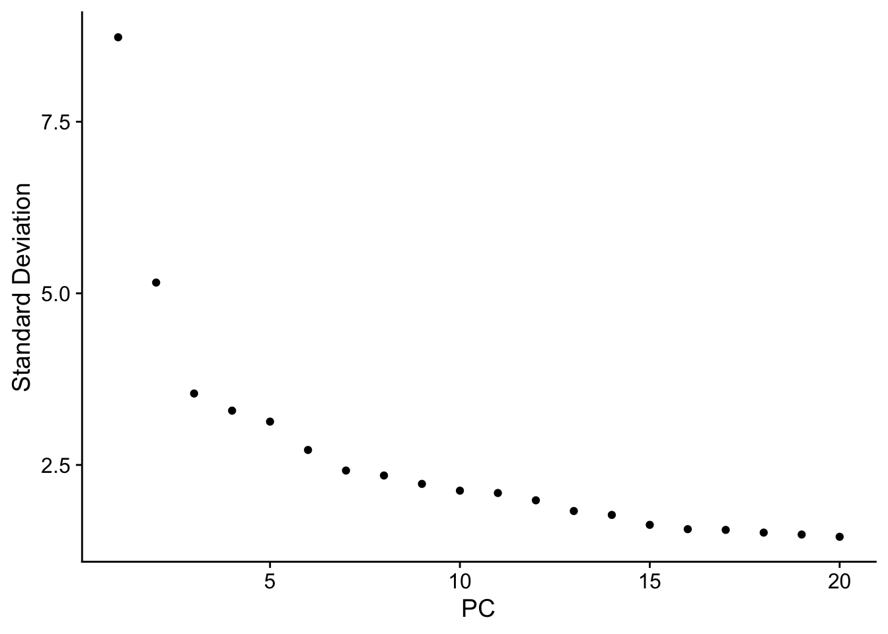

```r
ifnb.filtered <- RunUMAP(ifnb.filtered, dims = 1:20, reduction = 'pca')

## Warning: The default method for RunUMAP has changed from calling Python UMAP via reticulate to the R-native UWOT using the cosine metric
## To use Python UMAP via reticulate, set umap.method to 'umap-learn' and metric to 'correlation'
## This message will be shown once per session
## 14:30:14 UMAP embedding parameters a = 0.9922 b = 1.112
## 14:30:14 Read 13548 rows and found 20 numeric columns
## 14:30:14 Using Annoy for neighbor search, n_neighbors = 30
## 14:30:14 Building Annoy index with metric = cosine, n_trees = 50
## 0%   10   20   30   40   50   60   70   80   90   100%
## [----|----|----|----|----|----|----|----|----|----|
## **************************************************|
## 14:30:14 Writing NN index file to temp file /var/folders/pv/fvynh7953flggrfb49p2lqsc0000gn/T//RtmpZktc52/file2641625758f9
## 14:30:14 Searching Annoy index using 1 thread, search_k = 3000
## 14:30:17 Annoy recall = 100%
## 14:30:17 Commencing smooth kNN distance calibration using 1 thread with target n_neighbors = 30
## 14:30:17 Initializing from normalized Laplacian + noise (using RSpectra)
## 14:30:17 Commencing optimization for 200 epochs, with 582700 positive edges
## 14:30:21 Optimization finished

DimPlot(ifnb.filtered, reduction = 'umap', group.by = 'stim') # lets see how our cells separate by condition and whether integration is necessary
```
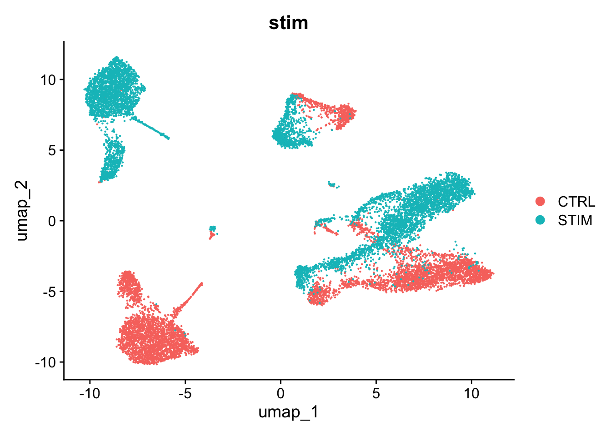
```r
DimPlot(ifnb.filtered, reduction = 'pca', group.by = 'stim') # lets see how our cells separate by condition and whether integration is necessary
```


These are PBMCs before and after treatment, there should be cells that are similar between both conditions, it looks like we'll have to run some batch effect correction to overlay similar cell-types from both conditions to perform downstream analysis

!!! question
    * Do you think we need to integrate our data? Hint: Look at the UMAP and PC1/PC2 plots we made above
    * What do you think would happen if we were to perform unsupervised clustering right now, without integrating our data (or overlaying similar cells ontop of each other from both conditions)?

### Step 4: Integrating our data using the harmony method

Seurat v5 has made it really easy to test different integration methods quickly, let's use a really popular approach (harmony) first.

```r
# code adapted from: https://satijalab.org/seurat/articles/seurat5_integration
ifnb.filtered <- IntegrateLayers(object = ifnb.filtered,
                                 method = HarmonyIntegration,
                                 orig.reduction = "pca", 
                                 new.reduction = "harmony")

## Transposing data matrix
## Using automatic lambda estimation
## Initializing state using k-means centroids initialization
## Harmony 1/10
## Harmony 2/10
## Harmony 3/10
## Harmony converged after 3 iterations

ifnb.filtered <- RunUMAP(ifnb.filtered, reduction = "harmony", dims = 1:20, reduction.name = "umap.harmony")

## 14:30:30 UMAP embedding parameters a = 0.9922 b = 1.112
## 14:30:30 Read 13548 rows and found 20 numeric columns
## 14:30:30 Using Annoy for neighbor search, n_neighbors = 30
## 14:30:30 Building Annoy index with metric = cosine, n_trees = 50
## 0%   10   20   30   40   50   60   70   80   90   100%
## [----|----|----|----|----|----|----|----|----|----|
## **************************************************|
## 14:30:30 Writing NN index file to temp file /var/folders/pv/fvynh7953flggrfb49p2lqsc0000gn/T//RtmpZktc52/file2641501f5779
## 14:30:30 Searching Annoy index using 1 thread, search_k = 3000
## 14:30:32 Annoy recall = 100%
## 14:30:32 Commencing smooth kNN distance calibration using 1 thread with target n_neighbors = 30
## 14:30:33 Initializing from normalized Laplacian + noise (using RSpectra)
## 14:30:33 Commencing optimization for 200 epochs, with 586972 positive edges
## 14:30:37 Optimization finished

after.harmony <- DimPlot(ifnb.filtered, reduction = "umap.harmony", group.by = "stim") + 
  ggtitle("After Harmony Integration")
before.integration <- DimPlot(ifnb.filtered, reduction = "umap", group.by = "stim") +
  ggtitle("Before Integration")

before.integration | after.harmony
```
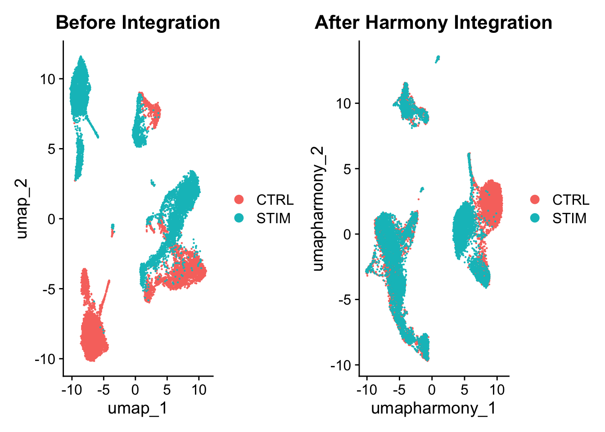

!!! question
    Looking at the UMAPs above, do you think integration was successful? Have a slide on what if its just different cell types.

#### Trying a different integration method (Seurat CCA), lets see if our integration improves

!!! question
    Try looking at the PC1 and PC2 plots for harmony and seurat as well

```r
ifnb.filtered <- IntegrateLayers(object = ifnb.filtered,
                                 method = CCAIntegration,
                                 orig.reduction = "pca", 
                                 new.reduction = "integrated.cca")

## Finding all pairwise anchors
## Running CCA
## Merging objects
## Finding neighborhoods
## Finding anchors
##  Found 13439 anchors
## Merging dataset 1 into 2
## Extracting anchors for merged samples
## Finding integration vectors
## Finding integration vector weights
## Integrating data

ifnb.filtered <- RunUMAP(ifnb.filtered, reduction = "integrated.cca", dims = 1:20, reduction.name = "umap.cca")

## 14:32:20 UMAP embedding parameters a = 0.9922 b = 1.112
## 14:32:20 Read 13548 rows and found 20 numeric columns
## 14:32:20 Using Annoy for neighbor search, n_neighbors = 30
## 14:32:20 Building Annoy index with metric = cosine, n_trees = 50
## 0%   10   20   30   40   50   60   70   80   90   100%
## [----|----|----|----|----|----|----|----|----|----|
## **************************************************|
## 14:32:20 Writing NN index file to temp file /var/folders/pv/fvynh7953flggrfb49p2lqsc0000gn/T//RtmpZktc52/file26411d5fec2d
## 14:32:20 Searching Annoy index using 1 thread, search_k = 3000
## 14:32:22 Annoy recall = 100%
## 14:32:23 Commencing smooth kNN distance calibration using 1 thread with target n_neighbors = 30
## 14:32:23 Initializing from normalized Laplacian + noise (using RSpectra)
## 14:32:23 Commencing optimization for 200 epochs, with 595440 positive edges
## 14:32:27 Optimization finished

after.seuratCCA <- DimPlot(ifnb.filtered, reduction = "umap.cca", group.by = "stim") +
  ggtitle("After Seurat CCA Integration")

before.integration | after.seuratCCA
```


```r
after.harmony | after.seuratCCA

## Show example slide of integration 'failing' but due to different cell types in each sample ***
```


!!! question
    What do you think of the integration results now?

    **Challenge:** look at the pc1/2 plots for each integration method -\> explain different pca slots here

\*\*Slide on the caveats of integration, you can lose biological signal when you regress out technical batch effects\*\*

### Step 5: Once we're happy with integration we need to rejoin layers before moving on to DE

This step collapses individual control and treatment datasets together and needs to be done before differential expression analysis

```r
ifnb.filtered <- FindNeighbors(ifnb.filtered, reduction = "integrated.cca", dims = 1:20)

## Computing nearest neighbor graph
## Computing SNN

ifnb.filtered <- FindClusters(ifnb.filtered, resolution = 0.5)

## Modularity Optimizer version 1.3.0 by Ludo Waltman and Nees Jan van Eck
## 
## Number of nodes: 13548
## Number of edges: 522234
## 
## Running Louvain algorithm...
## Maximum modularity in 10 random starts: 0.9001
## Number of communities: 14
## Elapsed time: 1 seconds

ifnb.filtered <- JoinLayers(ifnb.filtered)
```

## Part 2: Differential Gene Expression when dealing with two treatment conditions

```r
DimPlot(ifnb.filtered, reduction = "umap.cca", label = T)
```
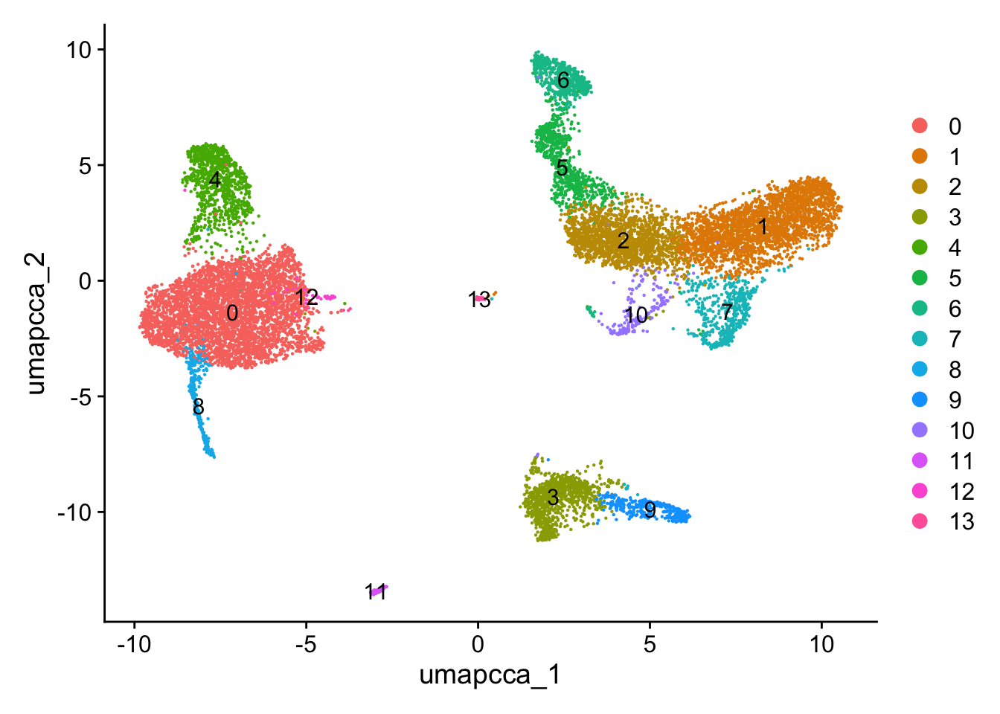

```r
DimPlot(ifnb.filtered, reduction = "umap.cca", group.by = "stim")
```
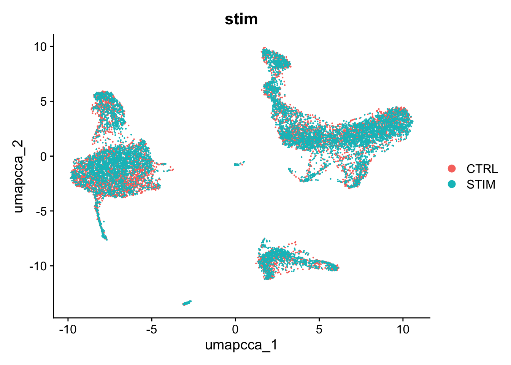

### Step 1. Find Conserved Markers to label our celltypes

```r
## Let's look at conserved markers in cluster 4 across our two conditions (compared to all other clusters)
markers.cluster.4 <- FindConservedMarkers(ifnb.filtered, ident.1 = 4,
                     grouping.var = 'stim')

## Testing group CTRL: (4) vs (0, 11, 2, 7, 1, 5, 10, 9, 3, 6, 12, 8, 13)
## For a (much!) faster implementation of the Wilcoxon Rank Sum Test,
## (default method for FindMarkers) please install the presto package
## --------------------------------------------
## install.packages('devtools')
## devtools::install_github('immunogenomics/presto')
## --------------------------------------------
## After installation of presto, Seurat will automatically use the more 
## efficient implementation (no further action necessary).
## This message will be shown once per session
## Testing group STIM: (4) vs (5, 11, 1, 3, 0, 7, 9, 2, 6, 8, 10, 12, 13)

head(markers.cluster.4)

##          CTRL_p_val CTRL_avg_log2FC CTRL_pct.1 CTRL_pct.2 CTRL_p_val_adj
## VMO1    0.00000e+00        6.017864      0.841      0.060   0.000000e+00
## FCGR3A  0.00000e+00        4.135634      0.980      0.204   0.000000e+00
## MS4A7   0.00000e+00        3.739717      0.957      0.196   0.000000e+00
## CXCL16  0.00000e+00        2.929754      0.951      0.233   0.000000e+00
## MS4A4A  0.00000e+00        5.147604      0.581      0.025   0.000000e+00
## LST1   1.88603e-288        2.858100      0.929      0.251  2.650439e-284
##        STIM_p_val STIM_avg_log2FC STIM_pct.1 STIM_pct.2 STIM_p_val_adj
## VMO1            0        7.576584      0.717      0.022              0
## FCGR3A          0        5.125698      0.989      0.128              0
## MS4A7           0        3.916075      0.991      0.219              0
## CXCL16          0        3.852775      0.922      0.148              0
## MS4A4A          0        4.821562      0.899      0.073              0
## LST1            0        3.057945      0.890      0.192              0
##            max_pval minimump_p_val
## VMO1    0.00000e+00              0
## FCGR3A  0.00000e+00              0
## MS4A7   0.00000e+00              0
## CXCL16  0.00000e+00              0
## MS4A4A  0.00000e+00              0
## LST1   1.88603e-288              0

## **Explain p_val adjusted and p_val and avg_log2FC** in slide
```

Let's visualise the top features identified in this cluster

(Will need to explain the min.cutoff value here)

!!! question
    Try running this function without defining a min.cutoff, or changing the value

```r
# Try looking up some of these markers here: https://www.proteinatlas.org/
FeaturePlot(ifnb.filtered, reduction = "umap.cca", 
            features = c('VMO1', 'FCGR3A', 'MS4A7', 'CXCL16'), min.cutoff = 'q10')
```


```r
# I happen to know that the cells in cluster 3 are CD16 monocytes - lets rename this cluster
Idents(ifnb.filtered) # Let's look at the identities of our cells at the moment
```

??? info "Cell identities"
    ```
    --8<--
    docs/tutorials/seurat-de/idents-ifnb-filtered-0.txt
    --8<--
    ```

```r
ifnb.filtered <- RenameIdents(ifnb.filtered, '4' = 'CD16 Mono') # Let's rename cells in cluster 3 with a new cell type label
Idents(ifnb.filtered) # we can take a look at the cell identities again
```

??? info "Cell identities"
    ```
    --8<--
    docs/tutorials/seurat-de/idents-ifnb-filtered-1.txt
    --8<--
    ```


```r
DimPlot(ifnb.filtered, reduction = "umap.cca", label = T) +
  ggtitle("After changing the identity of cluster 4")
```


### Step 2: Set the identity of our clusters to the annotations provided

```r
Idents(ifnb.filtered) <- ifnb.filtered@meta.data$seurat_annotations
Idents(ifnb.filtered)
```

??? info "Cell identities"
    ```
    --8<--
    docs/tutorials/seurat-de/idents-ifnb-filtered-2.txt
    --8<--
    ```


```r
DimPlot(ifnb.filtered, reduction = "umap.cca", label = T)
```


!!! tip
    Refer to automatic cell type annotation in slide.

### Step 3: Find DEGs between our two conditions (using CD16 Mono cells as an example)

```r
# Make another column in metadata showing what cells belong to each treatment group (This will make more sense in a bit)
ifnb.filtered$celltype.and.stim <- paste0(ifnb.filtered$seurat_annotations, '_', ifnb.filtered$stim)
View(ifnb.filtered@meta.data)

Idents(ifnb.filtered) <- ifnb.filtered$celltype.and.stim

DimPlot(ifnb.filtered, reduction = "umap.cca", label = T) # each cluster is now made up of two labels (control or stimulated)
```


```r
DimPlot(ifnb.filtered, reduction = "umap.cca", 
        label = T, split.by = "stim") # Lets separate by condition to see what we've done a bit more clearly
```


We'll now leverage these new identities to compare DEGs between our treatment groups

```r
treatment.response.CD16 <- FindMarkers(ifnb.filtered, ident.1 = 'CD16 Mono_STIM', 
                                       ident.2 = 'CD16 Mono_CTRL')
head(treatment.response.CD16) # These are the genes that are upregulated in the stimulated versus control group

##                p_val avg_log2FC pct.1 pct.2     p_val_adj
## IFIT1  1.379187e-176   5.834216 1.000 0.094 1.938172e-172
## ISG15  6.273887e-166   5.333771 1.000 0.478 8.816694e-162
## IFIT3  1.413978e-164   4.412990 0.992 0.314 1.987063e-160
## ISG20  6.983755e-164   4.088510 1.000 0.448 9.814270e-160
## IFITM3 1.056793e-161   3.191513 1.000 0.634 1.485111e-157
## IFIT2  7.334976e-159   4.622453 0.974 0.162 1.030784e-154

```

### Step 5: Lets plot conserved features vs DEGs between conditions

```r
FeaturePlot(ifnb.filtered, reduction = 'umap.cca', 
            features = c('VMO1', 'FCGR3A', 'IFIT1', 'ISG15'),
            split.by = 'stim', min.cutoff = 'q10')
```

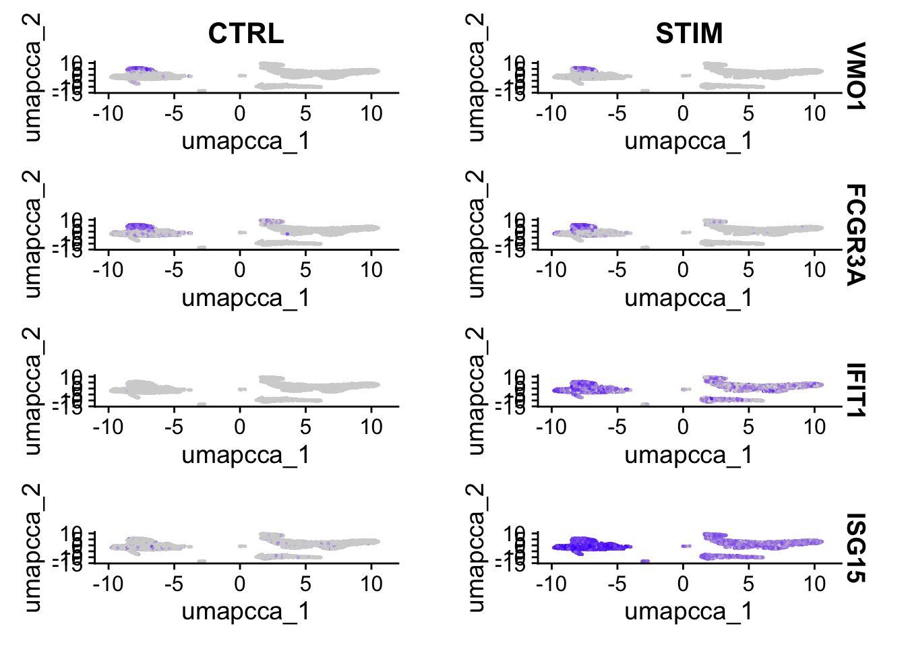

### Step 6: Create a Heatmap to visualise DEGs between our two conditions + cell types

```r
# # Find upregulated genes in each group (cell type and condition)
# ifnb.treatVsCtrl.markers <- FindAllMarkers(ifnb.filtered,
#                                           only.pos = TRUE)
# saveRDS(ifnb.treatVsCtrl.markers, "ifnb_stimVsCtrl_markers.rds")
```

```output

Calculating cluster CD14 Mono_CTRL
  |++++++++++++++++++++++++++++++++++++++++++++++++++| 100% elapsed=22s  
Calculating cluster pDC_CTRL
  |++++++++++++++++++++++++++++++++++++++++++++++++++| 100% elapsed=01m 02s
Calculating cluster CD4 Memory T_CTRL
  |++++++++++++++++++++++++++++++++++++++++++++++++++| 100% elapsed=47s  
Calculating cluster T activated_CTRL
  |++++++++++++++++++++++++++++++++++++++++++++++++++| 100% elapsed=60s  
Calculating cluster CD4 Naive T_CTRL
  |++++++++++++++++++++++++++++++++++++++++++++++++++| 100% elapsed=49s  
Calculating cluster CD8 T_CTRL
  |++++++++++++++++++++++++++++++++++++++++++++++++++| 100% elapsed=58s  
Calculating cluster Mk_CTRL
  |++++++++++++++++++++++++++++++++++++++++++++++++++| 100% elapsed=38s  
Calculating cluster B Activated_CTRL
  |++++++++++++++++++++++++++++++++++++++++++++++++++| 100% elapsed=52s  
Calculating cluster B_CTRL
  |++++++++++++++++++++++++++++++++++++++++++++++++++| 100% elapsed=52s  
Calculating cluster CD16 Mono_CTRL
  |++++++++++++++++++++++++++++++++++++++++++++++++++| 100% elapsed=24s  
Calculating cluster NK_CTRL
  |++++++++++++++++++++++++++++++++++++++++++++++++++| 100% elapsed=01m 02s
Calculating cluster DC_CTRL
  |++++++++++++++++++++++++++++++++++++++++++++++++++| 100% elapsed=33s  
Calculating cluster Eryth_CTRL
  |++++++++++++++++++++++++++++++++++++++++++++++++++| 100% elapsed=13s  
Calculating cluster CD8 T_STIM
  |++++++++++++++++++++++++++++++++++++++++++++++++++| 100% elapsed=48s  
Calculating cluster pDC_STIM
  |++++++++++++++++++++++++++++++++++++++++++++++++++| 100% elapsed=56s  
Calculating cluster CD4 Naive T_STIM
  |++++++++++++++++++++++++++++++++++++++++++++++++++| 100% elapsed=41s  
Calculating cluster B_STIM
  |++++++++++++++++++++++++++++++++++++++++++++++++++| 100% elapsed=45s  
Calculating cluster CD14 Mono_STIM
  |++++++++++++++++++++++++++++++++++++++++++++++++++| 100% elapsed=17s  
Calculating cluster T activated_STIM
  |++++++++++++++++++++++++++++++++++++++++++++++++++| 100% elapsed=53s  
Calculating cluster CD4 Memory T_STIM
  |++++++++++++++++++++++++++++++++++++++++++++++++++| 100% elapsed=35s  
Calculating cluster B Activated_STIM
  |++++++++++++++++++++++++++++++++++++++++++++++++++| 100% elapsed=51s  
Calculating cluster NK_STIM
  |++++++++++++++++++++++++++++++++++++++++++++++++++| 100% elapsed=52s  
Calculating cluster CD16 Mono_STIM
  |++++++++++++++++++++++++++++++++++++++++++++++++++| 100% elapsed=21s  
Calculating cluster DC_STIM
  |++++++++++++++++++++++++++++++++++++++++++++++++++| 100% elapsed=23s  
Calculating cluster Mk_STIM
  |++++++++++++++++++++++++++++++++++++++++++++++++++| 100% elapsed=38s  
Calculating cluster Eryth_STIM
  |++++++++++++++++++++++++++++++++++++++++++++++++++| 100% elapsed=13s
```

Uncomment the top code block to run from scratch -\> We'll load in the saved output since this can take a while

Seurat's in built heatmap function can be quite messy and hard to interpret sometimes (we'll learn how to make better and clearer custom heatmaps from our Seurat scRNA-seq data in a bit).

```r
ifnb.treatVsCtrl.markers <- readRDS("ifnb_stimVsCtrl_markers.rds")

top5 <- ifnb.treatVsCtrl.markers %>%
  group_by(cluster) %>%
  dplyr::filter(avg_log2FC > 1) %>%
  slice_head(n = 5) %>%
  ungroup()

DEG.heatmap <- DoHeatmap(ifnb.filtered, features = top5$gene,
          label = FALSE)

DEG.heatmap
```

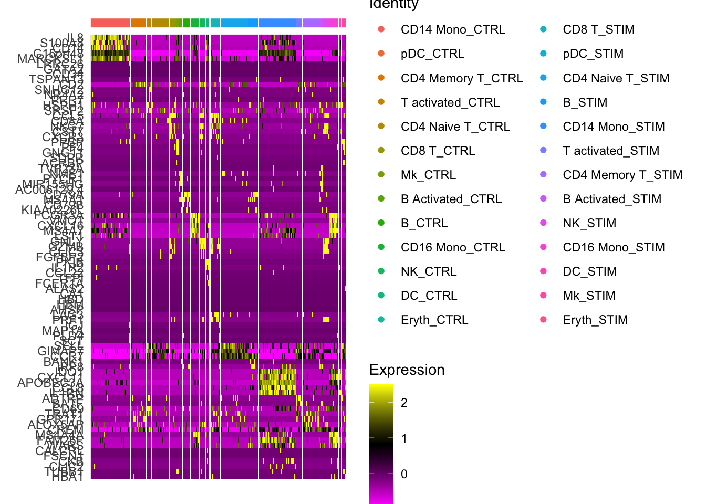

## Part 3 : Differential Expression using a pseudobulk approach and DESeq2

### Step 1: We need to import sample information for each cell from the original paper

!!! question
    have a look at the ifnb.filtered seurat metadata, can you spot what we've done here?

```r
# defining a function here to retrieve that information (code from https://satijalab.org/seurat/articles/de_vignette)
loadDonorMetadata <- function(seu.obj){
  # load the inferred sample IDs of each cell
  ctrl <- read.table(url("https://raw.githubusercontent.com/yelabucsf/demuxlet_paper_code/master/fig3/ye1.ctrl.8.10.sm.best"), head = T, stringsAsFactors = F)
  stim <- read.table(url("https://raw.githubusercontent.com/yelabucsf/demuxlet_paper_code/master/fig3/ye2.stim.8.10.sm.best"), head = T, stringsAsFactors = F)
  info <- rbind(ctrl, stim)
  
  # rename the cell IDs by substituting the '-' into '.'
  info$BARCODE <- gsub(pattern = "\\-", replacement = "\\.", info$BARCODE)
  
  # only keep the cells with high-confidence sample ID
  info <- info[grep(pattern = "SNG", x = info$BEST), ]
  
  # remove cells with duplicated IDs in both ctrl and stim groups
  info <- info[!duplicated(info$BARCODE) & !duplicated(info$BARCODE, fromLast = T), ]
  
  # now add the sample IDs to ifnb 
  rownames(info) <- info$BARCODE
  info <- info[, c("BEST"), drop = F]
  names(info) <- c("donor_id")
  seu.obj <- AddMetaData(seu.obj, metadata = info)
  
  # remove cells without donor IDs
  seu.obj$donor_id[is.na(seu.obj$donor_id)] <- "unknown"
  seu.obj <- subset(seu.obj, subset = donor_id != "unknown")
  
  return(seu.obj)
}

ifnb.filtered <- loadDonorMetadata(ifnb.filtered)
```

### Step 2: Aggregate our counts based on treatment group, cell-type, and donor id

Condensing our single-cell matrix in this manner is referred to 'pseudobulking'. We're making a condensed count matrix that looks more like a bulk matrix so that we can use bulk differential expression algorithms like DESeq2. We can see this clearly when we have a look at the ifnb.pseudbulk.df we make in the following code block.

```r
ifnb.pseudobulk <- AggregateExpression(ifnb.filtered, assays = "RNA",
                                   group.by = c("stim", "donor_id", "seurat_annotations"),
                                   return.seurat = TRUE)

## Centering and scaling data matrix

View(ifnb.pseudobulk@meta.data)

# If you want the pseudobulk matrix as a dataframe you can do this:
ifnb.pseudobulk.df <- AggregateExpression(ifnb.filtered, assays = "RNA",
                                          group.by = c("stim", "donor_id", "seurat_annotations")) %>% 
  as.data.frame()

head(ifnb.pseudobulk.df)
```

??? note "Pseudobulk dataframe output"
    ```
    --8<--
    docs/tutorials/seurat-de/infb-pseudobulk-df.txt
    --8<--
    ```


### Step 3: Perform Differential Expression using DESeq2

Just like before, lets make a new column containing the cell type and treatment group before DE with DESeq2. We do this so that we can leverage the Idents() function combined with the FindMarkers function.

To use DESeq2 in older versions of Seurat (prior to v5) we would have to perform a myriad of convoluted data wrangling steps to convert our Seurat pseudobulk matrix into a format compatible with DESeq2 (or whatever bulk DE package being used). Fortunately in Seurat v5, these different bulk DE algorithms/packages have been wrapped into the FindMarker() functions - simplifying pseudobulk DE approaches immensely.

It is worth taking a look at the Seurat DE vignette on your own to see the other pseudobulk DE methods you can use. Do keep in mind that to use some of the DE tests, you need to install that package and load it as a library separately to Seurat, as we've done here with DESeq2 at the start.

```r
ifnb.pseudobulk$celltype.and.stim <- paste(ifnb.pseudobulk$seurat_annotations, ifnb.pseudobulk$stim, sep = "_")
Idents(ifnb.pseudobulk) <- "celltype.and.stim"

View(ifnb.pseudobulk@meta.data)

# Lets run a DEG test between treated and control CD 16 monocytes using the same FindMarkers function but with DESeq2
treatment.response.CD16.pseudo <- FindMarkers(object = ifnb.pseudobulk, 
                                      ident.1 = 'CD16 Mono_STIM', 
                                      ident.2 = 'CD16 Mono_CTRL',
                                      test.use = "DESeq2")

## converting counts to integer mode
## gene-wise dispersion estimates
## mean-dispersion relationship
## final dispersion estimates

head(treatment.response.CD16.pseudo)

##                p_val avg_log2FC pct.1 pct.2     p_val_adj
## IFIT3  1.564083e-134   4.601427     1     1 2.198006e-130
## IFIT2   2.122691e-84   4.613021     1     1  2.983017e-80
## ISG20   1.401656e-81   4.038272     1     1  1.969747e-77
## DDX58   1.366535e-73   3.448721     1     1  1.920392e-69
## NT5C3A  5.127048e-66   3.942571     1     1  7.205040e-62
## OASL    1.186412e-63   4.025025     1     1  1.667265e-59

# How are we able to use the same findmarkers function here?
head(Cells(ifnb.pseudobulk)) # our 'cells' are no longer barcodes, but have been renamed according to stim-donor-annotation when we aggregated our data earlier

## [1] "CTRL_SNG-101_CD14 Mono"    "CTRL_SNG-101_CD4 Naive T" 
## [3] "CTRL_SNG-101_CD4 Memory T" "CTRL_SNG-101_CD16 Mono"   
## [5] "CTRL_SNG-101_B"            "CTRL_SNG-101_CD8 T"
```

### Step 4: Assessing differences between our pseudbulk DEGs and single-cell DEGs

First lets take a look at the DEG dataframes we made for both.

!!! question
    Having a look at them, can you identify any differences? Can you think of any underlying reasons behind those differences?

    Hint: Look at the p_val and p_val_adj columns.

```r
head(treatment.response.CD16)

##                p_val avg_log2FC pct.1 pct.2     p_val_adj
## IFIT1  1.379187e-176   5.834216 1.000 0.094 1.938172e-172
## ISG15  6.273887e-166   5.333771 1.000 0.478 8.816694e-162
## IFIT3  1.413978e-164   4.412990 0.992 0.314 1.987063e-160
## ISG20  6.983755e-164   4.088510 1.000 0.448 9.814270e-160
## IFITM3 1.056793e-161   3.191513 1.000 0.634 1.485111e-157
## IFIT2  7.334976e-159   4.622453 0.974 0.162 1.030784e-154

head(treatment.response.CD16.pseudo)

##                p_val avg_log2FC pct.1 pct.2     p_val_adj
## IFIT3  1.564083e-134   4.601427     1     1 2.198006e-130
## IFIT2   2.122691e-84   4.613021     1     1  2.983017e-80
## ISG20   1.401656e-81   4.038272     1     1  1.969747e-77
## DDX58   1.366535e-73   3.448721     1     1  1.920392e-69
## NT5C3A  5.127048e-66   3.942571     1     1  7.205040e-62
## OASL    1.186412e-63   4.025025     1     1  1.667265e-59
```

Next let's take a look at the degree of overlap between the actual DEGs in both approaches.

To help with this, I'm just going to define a couple helper functions below.

```r
Merge_DEG_dataframes <- function(pseudobulk.de,
                                 singlecell.de){
  names(pseudobulk.de) <- paste0(names(pseudobulk.de), ".bulk")
  pseudobulk.de$gene <- rownames(pseudobulk.de)
  
  names(singlecell.de) <- paste0(names(singlecell.de), ".sc")
  singlecell.de$gene <- rownames(singlecell.de)
  
  merge_dat <- merge(singlecell.de, pseudobulk.de, by = "gene")
  merge_dat <- merge_dat[order(merge_dat$p_val.bulk), ]
  
  return(merge_dat)
}
Visualise_Overlapping_DEGs <- function(pseudobulk.de,
                                       singlecell.de){
  
  merge_dat <- Merge_DEG_dataframes(pseudobulk.de,
                                    singlecell.de)
  
  # Number of genes that are marginally significant in both; marginally significant only in bulk; and marginally     significant only in single-cell
  common <- merge_dat$gene[which(merge_dat$p_val_adj.bulk < 0.05 & 
                                   merge_dat$p_val_adj.sc < 0.05)]
  only_sc <- merge_dat$gene[which(merge_dat$p_val_adj.bulk > 0.05 & 
                                    merge_dat$p_val_adj.sc < 0.05)]
  only_pseudobulk <- merge_dat$gene[which(merge_dat$p_val_adj.bulk < 0.05 & 
                                      merge_dat$p_val_adj.sc > 0.05)]
  
  # Create a dataframe to plot overlaps
  overlap.info <- data.frame(
    category = c("Common", 
                 "Only in single-cell", 
                 "Only in pseudobulk"),
    count = c(length(common), length(only_sc), length(only_pseudobulk))
  )
  
  overlap.info$category <- factor(overlap.info$category, 
                                  levels = c("Common", 
                                             "Only in single-cell", 
                                             "Only in pseudobulk"))
  # Create the bar plot
  overlap.bar.plt <- ggplot(overlap.info, aes(x = category, y = count, fill = category)) +
    geom_bar(stat = "identity") +
    geom_text(aes(label = count), vjust = -0.5, size = 4) +
    theme_minimal() +
    labs(title = "Number of Overlapping and Unique DEGs from Single-Cell and Pseudobulk Tests",
         x = "",
         y = "Number of Genes") +
    theme(legend.position = "none",
          axis.text.x = element_text(angle = 45, hjust = 1))
  
  return(overlap.bar.plt)
}
```

Let's use the helper functions above to plot and view the overlap/agreement between our pseudobulk versus single-cell approaches

!!! question
    Can you explain why we're seeing the discrepencies we see between the two methods here?

    ```r
    merged_deg_data <- Merge_DEG_dataframes(pseudobulk.de = treatment.response.CD16.pseudo,
                                            singlecell.de = treatment.response.CD16)
    merged_deg_data %>% 
      dplyr::select(gene, 
                    p_val.sc, p_val.bulk,
                    p_val_adj.sc, p_val_adj.bulk) %>%
      head(10)

    ##        gene      p_val.sc    p_val.bulk  p_val_adj.sc p_val_adj.bulk
    ## 2866  IFIT3 1.413978e-164 1.564083e-134 1.987063e-160  2.198006e-130
    ## 2865  IFIT2 7.334976e-159  2.122691e-84 1.030784e-154   2.983017e-80
    ## 2992  ISG20 6.983755e-164  1.401656e-81 9.814270e-160   1.969747e-77
    ## 1626  DDX58 2.340153e-109  1.366535e-73 3.288617e-105   1.920392e-69
    ## 4129 NT5C3A 5.806396e-117  5.127048e-66 8.159728e-113   7.205040e-62
    ## 4185   OASL 5.497910e-147  1.186412e-63 7.726213e-143   1.667265e-59
    ## 4544 PLSCR1 6.905174e-116  3.783863e-61 9.703841e-112   5.317463e-57
    ## 3859 MYL12A  2.476988e-83  7.623767e-61  3.480912e-79   1.071368e-56
    ## 2859  IFI35  4.701828e-99  2.527378e-58  6.607479e-95   3.551724e-54
    ## 2661  HERC5  1.578848e-92  1.829060e-56  2.218755e-88   2.570378e-52

    # How many DEGs overlap between our two methods? Is there anything in the merged_deg_data frame that stands out to you?
    overlap.bar.plt <- Visualise_Overlapping_DEGs(pseudobulk.de = treatment.response.CD16.pseudo,
                                                  singlecell.de = treatment.response.CD16)

    overlap.bar.plt
    ```

  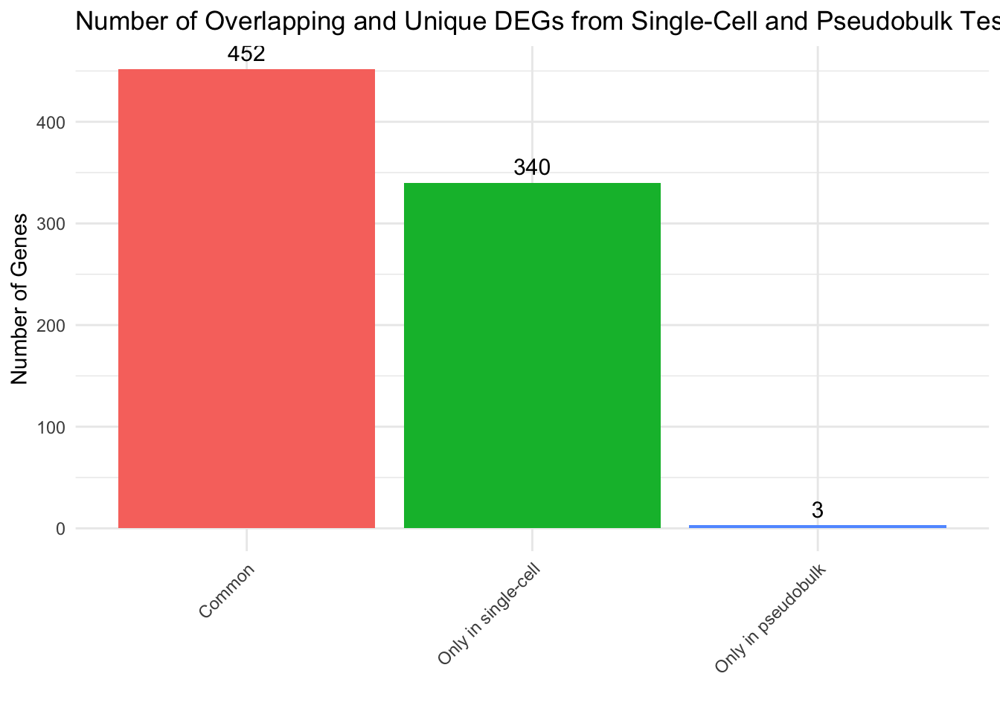

### Step 5: Investigate the differences between pseudobulk DE and single-cell DE closer

Let's create lists of genes in each of our categories first

```r
common <- merged_deg_data$gene[which(merged_deg_data$p_val.bulk < 0.05 & 
                                       merged_deg_data$p_val.sc < 0.05)]
only_sc <- merged_deg_data$gene[which(merged_deg_data$p_val.bulk > 0.05 & 
                                        merged_deg_data$p_val.sc < 0.05)]
only_pseudobulk <- merged_deg_data$gene[which(merged_deg_data$p_val.bulk < 0.05 & 
                                          merged_deg_data$p_val.sc > 0.05)]
```

Now I want to look at the expression of genes that only appear in our sc deg test and not in our pseudobulk deg test I've picked two genes from the 'only_sc' variable we just defined

```r
# create a new column to annotate sample-condition-celltype in the single-cell dataset
ifnb.filtered$donor_id.and.stim <- paste0(ifnb.filtered$stim, "-", ifnb.filtered$donor_id)
Idents(ifnb.filtered) <- "celltype.and.stim"

# Explore some genes that only appear in the sc deg test---
VlnPlot(ifnb.filtered, features = c("PABPC1", "SRGN"), 
        idents = c("CD16 Mono_CTRL", "CD16 Mono_STIM"), 
        group.by = "stim") 
```

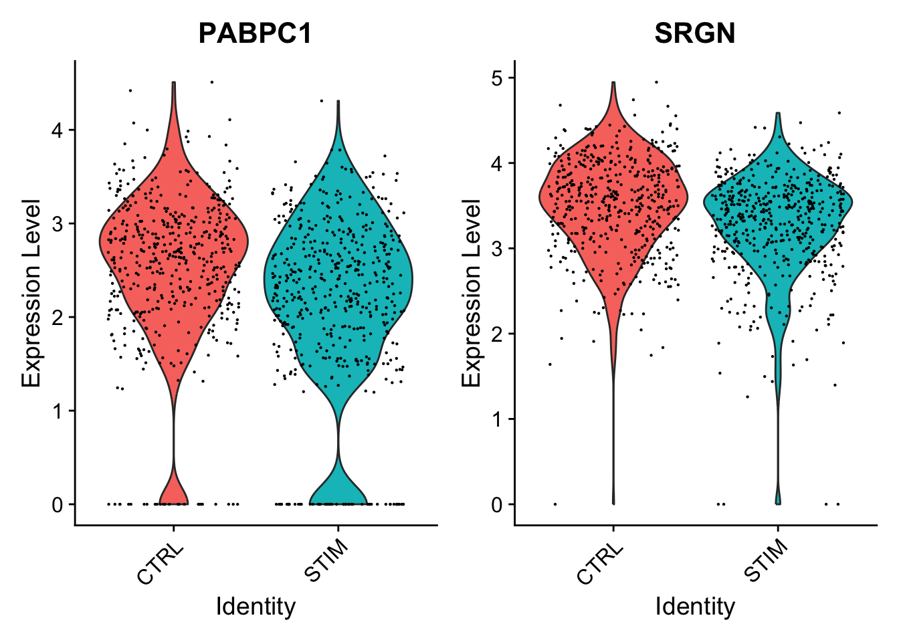

```r
VlnPlot(ifnb.filtered, features = c("PABPC1", "SRGN"), 
        idents = c("CD16 Mono_CTRL", "CD16 Mono_STIM"), 
        group.by = "donor_id.and.stim", ncol = 1)
```


!!! question
    How would you interpret the plots above? What does this tell you about some of the pitfalls of single-cell DE approaches?

Now lets take a look at some genes that show agreement across both sc and pseudobulk deg tests

```r
VlnPlot(ifnb.filtered, features = c("IFIT2", "PSMA4"), 
        idents = c("CD16 Mono_CTRL", "CD16 Mono_STIM"), 
        group.by = "stim") 
```

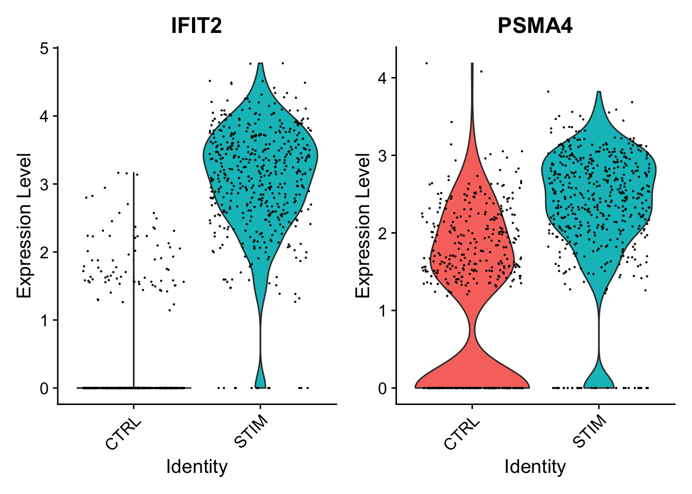

```r
VlnPlot(ifnb.filtered, features = c("IFIT2", "PSMA4"), 
        idents = c("CD16 Mono_CTRL", "CD16 Mono_STIM"), 
        group.by = "donor_id.and.stim", ncol = 1) 
```
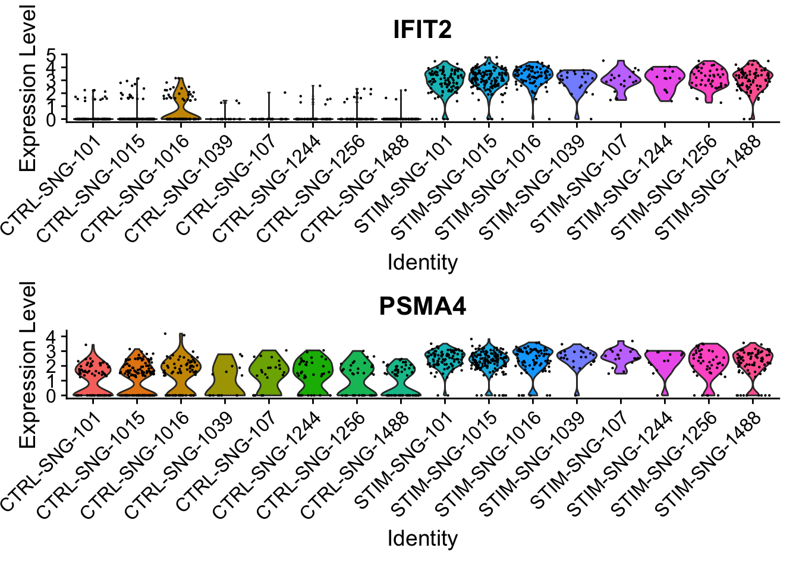

### Step 6: Creating our own custom visualisations for DEG analysis between cell-types in two different experimental groups

So far, we've been using functions wrapped within Seurat to plot and visualise our data. But we're not limited to those functions. Let's use the pheatmap ('pretty heatmap') package to visualise our DEGs with adjusted p values \< 0.05.

First lets look at our significant DEGs as defined by our pseudobulk approach

```r
CD16.sig.markers <- treatment.response.CD16.pseudo %>% 
  dplyr::filter(p_val_adj < 0.05) %>%
  dplyr::mutate(gene = rownames(.))
```

This is how we can pull our average (scaled) pseudobulk expression values from our seurat obj:

```r
ifnb.filtered$celltype.stim.donor_id <- paste0(ifnb.filtered$seurat_annotations, "-",
                                               ifnb.filtered$stim, "-", ifnb.filtered$donor_id)
Idents(ifnb.filtered) <- "celltype.stim.donor_id"

all.sig.avg.Expression.mat <- AverageExpression(ifnb.filtered, 
                         features = CD16.sig.markers$gene, 
                         layer = 'scale.data')

## As of Seurat v5, we recommend using AggregateExpression to perform pseudo-bulk analysis.
## This message is displayed once per session.

View(all.sig.avg.Expression.mat %>%
  as.data.frame())
```

Now lets make sure we're only using data from the CD16 cell type

```r
CD16.sig.avg.Expression.mat <- all.sig.avg.Expression.mat$RNA %>%
  as.data.frame() %>%
  dplyr::select(starts_with("CD16 Mono"))

View(CD16.sig.avg.Expression.mat)

```

Let's finally view our heatmap with averaged pseudobulk scaled expression values for our signficant DEGs

```r
pheatmap::pheatmap(CD16.sig.avg.Expression.mat,
         cluster_rows = TRUE,
         show_rownames = FALSE, 
         border_color = NA, 
         fontsize = 10, 
         scale = "row", 
         fontsize_row = 10, 
         height = 20)
```
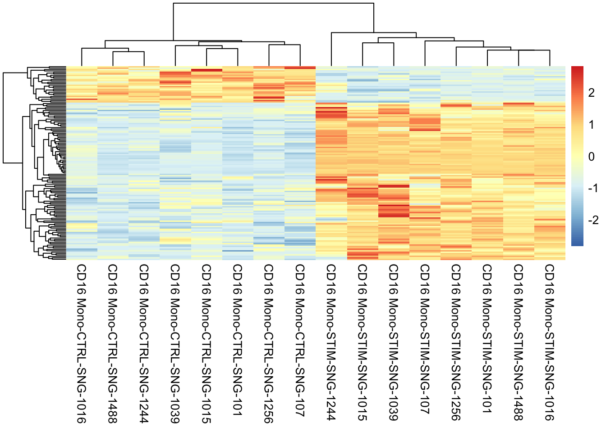

The cool thing about pheatmap is that we can customise our heatmap with added metadata

```r
cluster_metadata <- data.frame(
  row.names = colnames(CD16.sig.avg.Expression.mat)
) %>% 
  dplyr::mutate(
    Cell_Type = "CD16 Mono",
    Treatment_Group = ifelse(str_detect(row.names(.), "STIM|CTRL"), 
                      str_extract(row.names(.), "STIM|CTRL")))

sig.DEG.heatmap <- pheatmap::pheatmap(CD16.sig.avg.Expression.mat,
         cluster_rows = TRUE,
         show_rownames = FALSE,
         annotation = cluster_metadata[, c("Treatment_Group", "Cell_Type")], 
         border_color = NA, 
         fontsize = 10, 
         scale = "row", 
         fontsize_row = 10, 
         height = 20,
         annotation_names_col = FALSE)

sig.DEG.heatmap
```

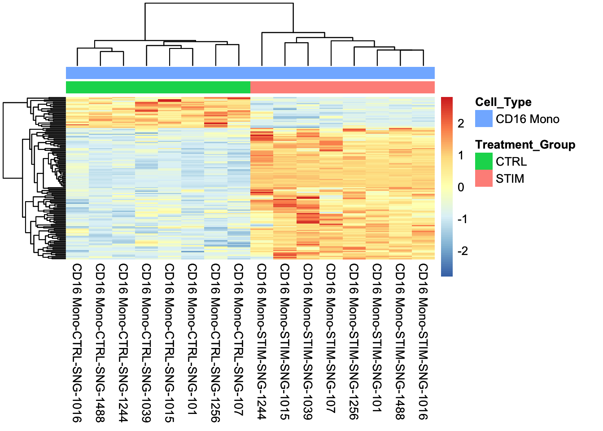

Lets save our heatmap using the grid library (very useful package!) Code from: <https://stackoverflow.com/questions/43051525/how-to-draw-pheatmap-plot-to-screen-and-also-save-to-file>

```r
save_pheatmap_pdf <- function(x, filename, width=7, height=7) {
   stopifnot(!missing(x))
   stopifnot(!missing(filename))
   pdf(filename, width=width, height=height)
   grid::grid.newpage()
   grid::grid.draw(x$gtable)
   dev.off()
}

save_pheatmap_pdf(sig.DEG.heatmap, "sig_DEG_pseudo.pdf")

## quartz_off_screen 
##                 2
```

!!! question "Challenge question"
    Do the same thing with significant DEGs from the sc approach. Do you see any differences?

    ??? note "Solution"
        Run the same code as above but with the `treatment.response.CD16` variable instead of `treatment.response.CD16.pseudo` variable.

!!! question 
    What kind of analyses can we do next after having a list of DEGs for each cell type and treatment groups?


---

