# Gene ontology analysis and integration for single-cell RNA-seq data

**Author:** Xiaochen Zhang, Lê Cao Lab, The University of Melbourne.  
**Contributors:** Vini Salazar, Melbourne Bioinformatics.

## Overview

**Topic**

* [ ] Genomics
* [x] Transcriptomics
* [ ] Proteomics
* [ ] Metabolomics
* [ ] Statistics and visualisation
* [ ] Structural Modelling
* [ ] Basic skills


**Skill level**

* [ ] Beginner  
* [x] Intermediate  
* [ ] Advanced  

**Data:** 10k Human PBMCs, Multiome v1.0, Chromium X.

**Tools:** R >= 4.4.0 and associated packages:  

- Seurat  
- SeuratData  
- clusterProfiler  
- Signac  
- ggplot2  

**Pipeline:**  
*Section 1:* Setup, Introduction, and Preprocessing.  
*Section 2:* Gene Ontology analysis.  
*Section 3:* Integration of ATAC-seq data.  

**Learning objectives:**  

- Apply GO enrichment analysis to identify biological processes, molecular functions, and cellular components represented in single-cell RNA-seq data.  
- Interpret GO results and identify key pathways and functional modules relevant to specific biological questions.  
- Design a workflow for integrating various omics layers, considering the biological context and research goals.  
- Take advantage of the Seurat, Signac and clusterProfiler R packages to perform the analysis, generate plots and interpret the results.  

<!--
!!! warning "Disclaimer"
    This tutorial is partially based on some existing material.
-->

<!-- Use this divider between sections -->
---
<!-- Use this divider between sections -->

## Setup

**Install R packages for this workshop**

You only need to run this code once.

```r
# install Packages
install.packages("Seurat")
setRepositories(ind=1:3) # needed to automatically install Bioconductor dependencies

if (!require("BiocManager", quietly = TRUE))
    install.packages("BiocManager")

BiocManager::install("Rsamtools")

install.packages("Signac")
install.packages("ggplot2")
install.packages("cowplot")
install.packages("devtools")
devtools::install_github('satijalab/seurat-data')

BiocManager::install("EnsDb.Hsapiens.v86")
BiocManager::install("biovizBase")
BiocManager::install(c('BSgenome.Hsapiens.UCSC.hg38', 'EnsDb.Hsapiens.v86'))
BiocManager::install("clusterProfiler")
BiocManager::install("org.Hs.eg.db")
BiocManager::install("enrichplot")
```

!!! success "Well done!"
    You are ready to start the workshop.


<!-- Use this divider between sections -->
---
<!-- Use this divider between sections -->

## Introduction

### Load these packages

```r
# load libraries
library(Seurat)
library(Signac)
library(EnsDb.Hsapiens.v86)
library(ggplot2)
library(cowplot)
library(clusterProfiler)
library(org.Hs.eg.db)
library(enrichplot)
```

### Download the datasets

```r
library(SeuratData)
# install the dataset and load requirements
InstallData("pbmcMultiome")
```

### Load the datasets (Seurat object)

We will use two datasets in this workshop. One is single-cell RNA-seq data
(`pbmc.rna`), and the other is single-cell ATAC-seq data
(`pbmc.atac`). We will do a gene ontology analysis for the single-cell
RNA-seq dataset first. Afterwards, we will integrate the scRNA-seq dataset with the
scATAC-seq dataset to explain differences observed in the
scRNA-seq data.

```r
# load both modalities
pbmc.rna <- LoadData("pbmcMultiome", "pbmc.rna")
pbmc.atac <- LoadData("pbmcMultiome", "pbmc.atac")
```

## Preprocessing for single-cell RNA-seq data (Seurat pipeline)

### QC for RNA data (already performed and saved in the dataset)

In order to focus this workshop on downstream analysis, we have performed the QC
steps for the RNA data and applied the label 'filtered'. We move forward by 
selecting only cells that are not labelled 'filtered'.

```r
# We use Seurat V5 object
pbmc.rna[["RNA"]] <- as(pbmc.rna[["RNA"]], Class = "Assay5")
# repeat QC steps performed in the WNN vignette
pbmc.rna <- subset(pbmc.rna, seurat_annotations != "filtered")
```

### Preprocess RNA data (from Seurat workshop)

We will perform standard Seurat pipeline for single-cell RNA analysis.
We will normalise the data, find variable features, scale the data, run
PCA, and run UMAP. See also our introduction to single-cell RNA-seq
workshop for more details.

```r
# Perform standard analysis of each modality independently RNA analysis
pbmc.rna <- NormalizeData(pbmc.rna)

## Normalising layer: counts

pbmc.rna <- FindVariableFeatures(pbmc.rna)

## Finding variable features for layer counts

pbmc.rna <- ScaleData(pbmc.rna)

## Centering and scaling data matrix

pbmc.rna <- RunPCA(pbmc.rna)
```

??? note "Output"
    ```r
    ## PC_ 1 
    ## Positive:  PLXDC2, SLC8A1, LRMDA, FCN1, TYMP, MCTP1, JAK2, RBM47, IRAK3, NAMPT 
    ##     DMXL2, TBXAS1, ZEB2, LYN, LRRK2, SAT1, GAB2, CYBB, TNFAIP2, CSF3R 
    ##     HCK, TLR2, CLEC7A, LYST, VCAN, DENND1A, FGD4, CD36, GRK3, FAM49A 
    ## Negative:  CD247, IL32, CAMK4, IL7R, LTB, LEF1, BACH2, INPP4B, BCL2, SYNE2 
    ##     THEMIS, TRBC2, RORA, TXK, ANK3, CD69, TRBC1, MLLT3, APBA2, ACTG1 
    ##     RASGRF2, NELL2, LINC01934, TAFA1, SAMD3, PCAT1, PFN1, NCALD, CTSW, KCNQ5 
    ## PC_ 2 
    ## Positive:  CD247, IL32, DPYD, IL7R, INPP4B, AOAH, CAMK4, PDE3B, THEMIS, TXK 
    ##     RORA, LEF1, SLCO3A1, NEAT1, FNDC3B, ARHGAP26, ANXA1, SRGN, ADGRE5, SAMD3 
    ##     SYNE2, NCALD, TRBC1, CTSW, PLCB1, APBA2, CCL5, S100A4, TGFBR3, PRF1 
    ## Negative:  BANK1, PAX5, MS4A1, FCRL1, NIBAN3, AFF3, IGHM, EBF1, LINC00926, OSBPL10 
    ##     RALGPS2, CD79A, CD22, COBLL1, BLK, BLNK, AP002075.1, ADAM28, IGHD, COL19A1 
    ##     BCL11A, CD79B, PLEKHG1, GNG7, DENND5B, WDFY4, TCF4, AC120193.1, RUBCNL, SPIB 
    ## PC_ 3 
    ## Positive:  BACH2, LEF1, PDE3B, CAMK4, IL7R, LTB, ANK3, FHIT, INPP4B, NELL2 
    ##     BCL2, RASGRF2, CSGALNACT1, SLC2A3, MLLT3, AC139720.1, PLCL1, PRKN, PAX5, FCRL1 
    ##     LINC00926, TSHZ2, MS4A1, PTPRK, AL589693.1, CD79A, EBF1, ST6GALNAC3, BANK1, COL19A1 
    ## Negative:  GZMB, NKG7, GNLY, PRF1, KLRD1, GZMA, CST7, CLIC3, CCL5, FGFBP2 
    ##     SPON2, ADGRG1, KLRF1, GZMH, CCL4, TGFBR3, LINC00996, LINC01478, PDGFD, PTGDR 
    ##     C1orf21, FCRL6, CLEC4C, SLAMF7, BNC2, CTSW, IL2RB, EPHB1, LILRA4, HOPX 
    ## PC_ 4 
    ## Positive:  NKG7, GNLY, PRF1, KLRD1, GZMA, CST7, CCL5, FGFBP2, MCTP2, ADGRG1 
    ##     GZMH, CCL4, KLRF1, FCGR3A, SPON2, TGFBR3, PDGFD, PAX5, FCRL1, MS4A1 
    ##     FCRL6, PTGDR, BNC2, MTSS1, CX3CR1, LINC00926, C1orf21, IL2RB, PPP2R2B, HOPX 
    ## Negative:  LINC01478, CUX2, EPHB1, CLEC4C, LILRA4, COL26A1, AC023590.1, PTPRS, SCN9A, LINC01374 
    ##     COL24A1, LINC00996, NRP1, PHEX, FAM160A1, TNFRSF21, PLXNA4, PACSIN1, SCAMP5, SLC35F3 
    ##     DNASE1L3, P3H2, LRRC26, PLD4, ITM2C, SCN1A-AS1, PLEKHD1, SERPINF1, SCT, PTCRA 
    ## PC_ 5 
    ## Positive:  CDKN1C, IFITM3, HES4, CSF1R, SMIM25, FCGR3A, MS4A7, LST1, AIF1, LRRC25 
    ##     AC104809.2, MAFB, CALHM6, CFD, AC020651.2, SERPINA1, GPBAR1, SIGLEC10, CST3, HMOX1 
    ##     CTSL, TCF7L2, FMNL2, HLA-DPA1, CKB, MTSS1, COTL1, IFI30, CCDC26, SPRED1 
    ## Negative:  PLCB1, VCAN, ARHGAP24, CSF3R, DYSF, LINC00937, FNDC3B, GLT1D1, VCAN-AS1, AC020916.1 
    ##     PDE4D, PADI4, ARHGAP26, CREB5, TREM1, MCTP2, CD36, MEGF9, KIF13A, MICAL2 
    ##     FCAR, ACSL1, CLMN, JUN, ANXA1, MIR646HG, RAB11FIP1, CRISPLD2, GNLY, ZBTB16
    ```

```r
pbmc.rna <- RunUMAP(pbmc.rna, dims = 1:30)

## Warning: The default method for RunUMAP has changed from calling Python UMAP via reticulate to the R-native UWOT using the cosine metric
## To use Python UMAP via reticulate, set umap.method to 'umap-learn' and metric to 'correlation'
## This message will be shown once per session
## 11:47:36 UMAP embedding parameters a = 0.9922 b = 1.112
## 11:47:36 Read 10412 rows and found 30 numeric columns
## 11:47:36 Using Annoy for neighbor search, n_neighbors = 30
## 11:47:36 Building Annoy index with metric = cosine, n_trees = 50
## 0%   10   20   30   40   50   60   70   80   90   100%
## [----|----|----|----|----|----|----|----|----|----|
## **************************************************|
## 11:47:36 Writing NN index file to temp file /var/folders/pv/fvynh7953flggrfb49p2lqsc0000gn/T//RtmpuPPPuo/file4dc32cd5de65
## 11:47:36 Searching Annoy index using 1 thread, search_k = 3000
## 11:47:38 Annoy recall = 100%
## 11:47:38 Commencing smooth kNN distance calibration using 1 thread with target n_neighbors = 30
## 11:47:39 Initializing from normalized Laplacian + noise (using RSpectra)
## 11:47:39 Commencing optimization for 200 epochs, with 450622 positive edges
## 11:47:42 Optimization finished
```

### Cluster and visualise the RNA data

Next, we obtain an overview of the RNA data by visualising clusters.

```r
# Clustering
pbmc.rna <- FindNeighbors(pbmc.rna, dims = 1:30)

## Computing nearest neighbor graph
## Computing SNN

pbmc.rna <- FindClusters(pbmc.rna, resolution = 0.5)

## Modularity Optimizer version 1.3.0 by Ludo Waltman and Nees Jan van Eck
## 
## Number of nodes: 10412
## Number of edges: 412246
## 
## Running Louvain algorithm...
## Maximum modularity in 10 random starts: 0.9154
## Number of communities: 17
## Elapsed time: 0 seconds

# Visualise the RNA data
DimPlot(pbmc.rna, group.by = "seurat_clusters", label = TRUE)
```


### Find marker genes for each cell sub-type

We found that clusters 2, 3, and 8 likely have different functions,
forming distinct clusters. We aim to find marker
genes for each cluster to further explore the differences.

```r
# Find marker genes for each cluster
Idents(pbmc.rna) <- "seurat_clusters"
marker.genes.pbmc.rna <- FindAllMarkers(pbmc.rna, only.pos = TRUE, 
                                        min.pct = 0.5, logfc.threshold = 0.5)

## Calculating cluster 0
## For a (much!) faster implementation of the Wilcoxon Rank Sum Test,
## (default method for FindMarkers) please install the presto package
## --------------------------------------------
## install.packages('devtools')
## devtools::install_github('immunogenomics/presto')
## --------------------------------------------
## After installation of presto, Seurat will automatically use the more 
## efficient implementation (no further action necessary).
## This message will be shown once per session
## Calculating cluster 1
## Calculating cluster 2
## Calculating cluster 3
## Calculating cluster 4
## Calculating cluster 5
## Calculating cluster 6
## Calculating cluster 7
## Calculating cluster 8
## Calculating cluster 9
## Calculating cluster 10
## Calculating cluster 11
## Calculating cluster 12
## Calculating cluster 13
## Calculating cluster 14
## Calculating cluster 15
## Calculating cluster 16
```


## Gene Ontology analysis

We now have a marker gene list for each cluster. But it can be difficult
to interpret a cluster based on gene names alone. A good method to
interpret a list of genes is gene ontology analysis. We will perform gene
ontology analysis to understand the biological functions of these marker
genes.

### Preview the marker genes

Let's have a look the data structure of the marker gene list.

```r
marker.genes.pbmc.rna[1:5, ]
```

|        | p_val <dbl\> | avg_log2FC <dbl\> | pct.1 <dbl\> | pct.2 <dbl\> | p_val_adj <dbl\> | cluster <fct\> | gene <chr\> |
|--------|------------:|-----------------:|------------:|------------:|----------------:|---------------|------------|
| LRMDA  |           0 |         3.907970 |       0.976 |       0.142 |               0 | 0             | LRMDA      |
| PLXDC2 |           0 |         3.948556 |       0.994 |       0.171 |               0 | 0             | PLXDC2     |
| SLC8A1 |           0 |         3.389460 |       0.977 |       0.158 |               0 | 0             | SLC8A1     |
| CSF3R  |           0 |         4.401877 |       0.903 |       0.092 |               0 | 0             | CSF3R      |
| RBM47  |           0 |         3.747440 |       0.935 |       0.153 |               0 | 0             | RBM47      |

### Find marker genes for Cluster 2, Cluster 3 and Cluster 8

Because the gene list is long, we will focus on Cluster 2, Cluster 3
and Cluster 8 marker genes with significant p-values (adjust p-value < 0.05).

```r
Cluster2.markers <- marker.genes.pbmc.rna[marker.genes.pbmc.rna$cluster==2 
                                           & marker.genes.pbmc.rna$p_val_adj < 0.05, ]
Cluster3.markers <- marker.genes.pbmc.rna[marker.genes.pbmc.rna$cluster==3 
                                           & marker.genes.pbmc.rna$p_val_adj < 0.05, ]
Cluster8.markers <- marker.genes.pbmc.rna[marker.genes.pbmc.rna$cluster==8
                                           & marker.genes.pbmc.rna$p_val_adj < 0.05, ]
```

### Convert gene symbols to Entrez IDs

Gene symbols are useful, because they can be easily understand by humans. But gene
symbols are not unique, so we need to convert them to Entrez IDs for gene
ontology analysis.

```r
Cluster2.gene_ids <- bitr(Cluster2.markers$gene, fromType = "SYMBOL",
                                   toType = "ENTREZID", OrgDb = org.Hs.eg.db)

## 'select()' returned 1:1 mapping between keys and columns
## Warning in bitr(Cluster2.markers$gene, fromType = "SYMBOL", toType =
## "ENTREZID", : 0.41% of input gene IDs are fail to map...

Cluster3.gene_ids <- bitr(Cluster3.markers$gene, fromType = "SYMBOL",
                                   toType = "ENTREZID", OrgDb = org.Hs.eg.db)

## 'select()' returned 1:1 mapping between keys and columns
## Warning in bitr(Cluster3.markers$gene, fromType = "SYMBOL", toType =
## "ENTREZID", : 1.01% of input gene IDs are fail to map...

Cluster8.gene_ids <- bitr(Cluster8.markers$gene, fromType = "SYMBOL",
                                   toType = "ENTREZID", OrgDb = org.Hs.eg.db)

## 'select()' returned 1:1 mapping between keys and columns
## Warning in bitr(Cluster8.markers$gene, fromType = "SYMBOL", toType =
## "ENTREZID", : 2.94% of input gene IDs are fail to map...

```

### Perform GO enrichment analysis for Cluster 2

Let's begin with Cluster 2. This section demonstrates how to perform gene ontology
analysis for Cluster 2. You can follow the same steps to do the analysis
for Cluster 3 and Cluster 8.

We will use the `enrichGO()` function from `clusterProfiler` package to
perform gene ontology analysis.

Firstly, we need to load the gene ontology database. We use the
`org.Hs.eg.db` database for human gene ontology analysis. If you want to
do gene ontology analysis for other species, you can find the
corresponding database via Bioconductor.

We will first focus on biological process (BP) ontology, so
`ont = "BP"`. There are also another two databases (CC:
Cellular Component and MF: Molecular Function), you can try them later.

We will set the p-value cutoff and q-value cutoff to 0.05 to control the
false positive rate and false negative rate respectively. We will also
set the p-value adjustment method to "BH" (Benjamini & Hochberg). If you
want to know more about p-value adjustment methods (why we need them and
what are they), see also:
<https://www.ncbi.nlm.nih.gov/pmc/articles/PMC6099145/>.

```r
Cluster2.ego <- enrichGO(gene = Cluster2.gene_ids$ENTREZID, 
                OrgDb = org.Hs.eg.db, 
                ont = "BP", # biological process
                pAdjustMethod = "BH", 
                pvalueCutoff = 0.05, 
                qvalueCutoff = 0.05, 
                readable = TRUE)
```

### Visualise the GO enrichment results

#### Bar plot

A standard way to visualise GO enrichment results is to use a bar plot.
It can tell you how many genes in the marker gene list overlap with each GO term,
and how significant the enrichment is.

```r
barplot(Cluster2.ego, showCategory=10, 
        title="GO Enrichment Analysis for Cluster 2")
```

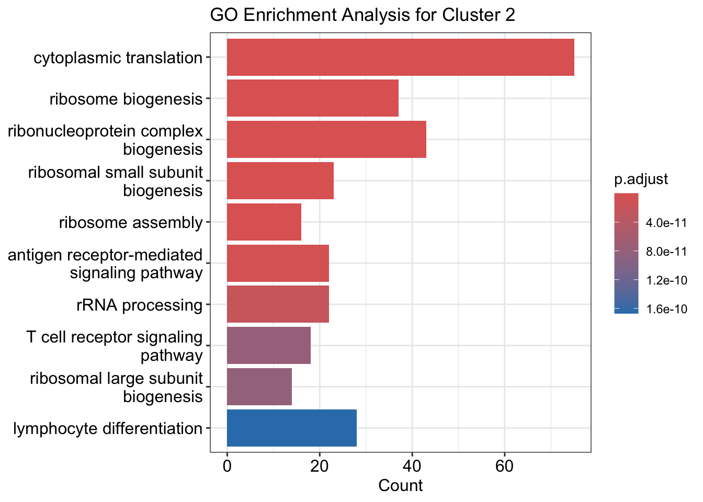

#### Dot plot

A dot plot is another way to visualise the GO enrichment results with more
information. It can show you the proportion of the overlapping genes, the 
overlapping gene counts, and the p-value for each GO term. You can also set
the number of GO terms you want to show.

```r
p1 <- dotplot(Cluster2.ego, showCategory=20, 
        title="GO Enrichment Analysis for Cluster 2")
p1 + theme(axis.text.y = element_text(size = 3))
```


#### Enrichment map plot

GO terms are correlated with each other. The enrichment map plot can
show you the correlation between GO terms. It can help you to understand
the relationship between different biological processes.

```r
Cluster2.ego <- pairwise_termsim(Cluster2.ego)
emapplot(Cluster2.ego, showCategory=20)
```

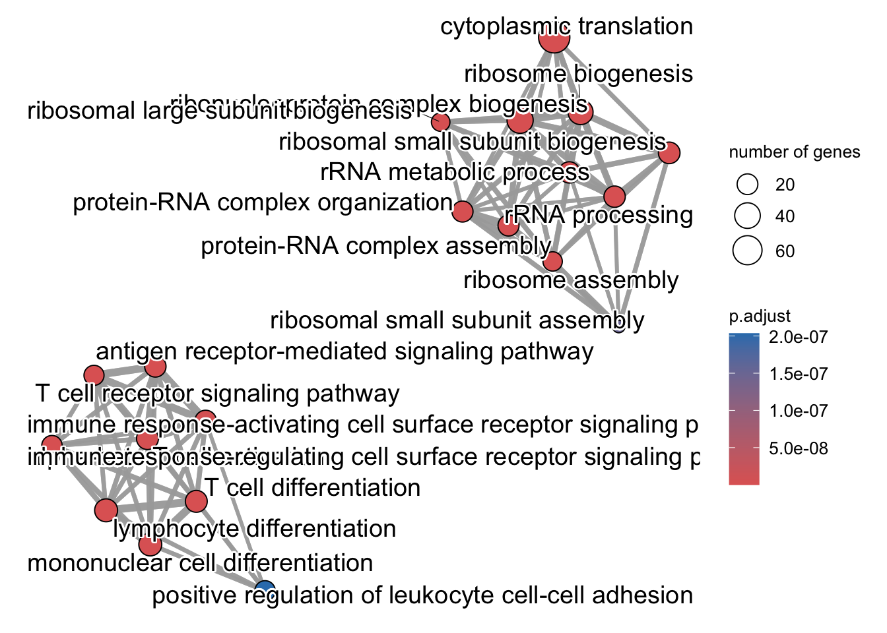

#### Cnet plot

A Cnet plot can show you the relationship between GO terms and genes.

```r
cnetplot(Cluster2.ego, categorySize="pvalue", 
         foldChange=Cluster2.gene_ids$ENTREZID, showCategory = 3)
```

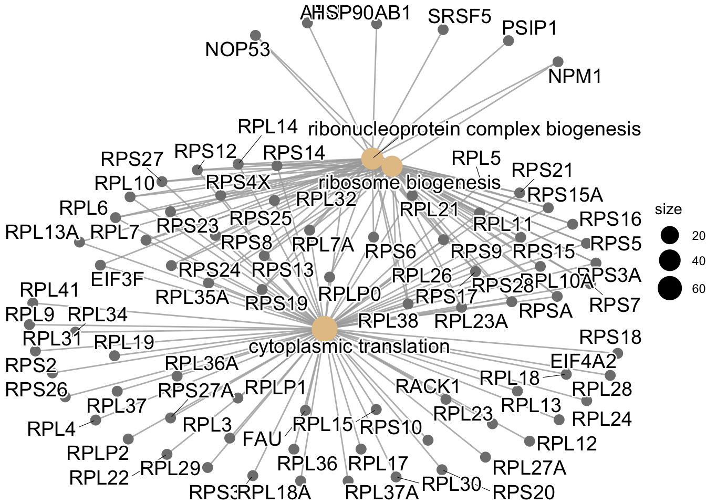

!!! question "Challenge"
    Perform GO enrichment analysis for the other 2 cluster.
    ??? info "Solution"
        ```r
        Cluster3.ego <- enrichGO(gene = Cluster3.gene_ids$ENTREZID, 
                        OrgDb = org.Hs.eg.db, 
                        ont = "BP",
                        pAdjustMethod = "BH", 
                        pvalueCutoff = 0.05, 
                        qvalueCutoff = 0.05, 
                        readable = TRUE)

        Cluster8.ego <- enrichGO(gene = Cluster8.gene_ids$ENTREZID,
                        OrgDb = org.Hs.eg.db, 
                        ont = "BP",
                        pAdjustMethod = "BH", 
                        pvalueCutoff = 0.05, 
                        qvalueCutoff = 0.05, 
                        readable = TRUE)
        ```


### Visualise the GO enrichment results for the other 2 clusters

```r
barplot(Cluster3.ego, showCategory=10, 
        title="GO Enrichment Analysis for Cluster 3")
```
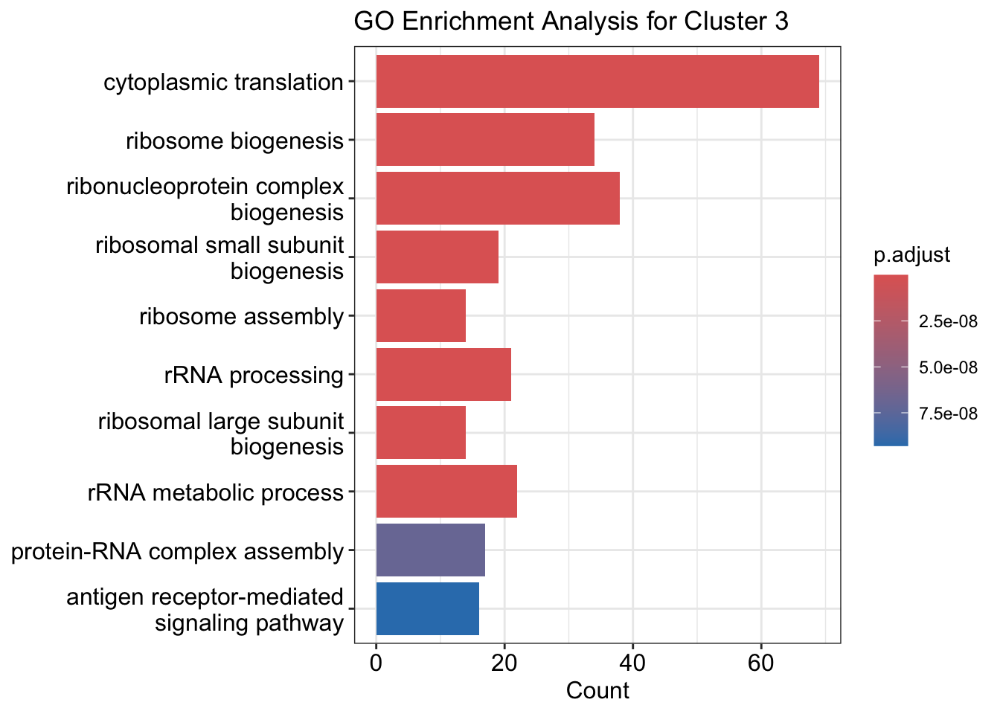

```r
p_cluster3 <- dotplot(Cluster3.ego, showCategory=20, 
        title="GO Enrichment Analysis for Cluster 3")
p_cluster3 + theme(axis.text.y = element_text(size = 3))
```


```r
Cluster3.ego <- pairwise_termsim(Cluster3.ego)
emapplot(Cluster3.ego, showCategory=20)
```


```r
cnetplot(Cluster3.ego, categorySize="pvalue", 
         foldChange=Cluster3.gene_ids$ENTREZID, showCategory = 3)

## Warning in cnetplot.enrichResult(x, ...): Use 'color.params = list(foldChange = your_value)' instead of 'foldChange'.
##  The foldChange parameter will be removed in the next version.
```
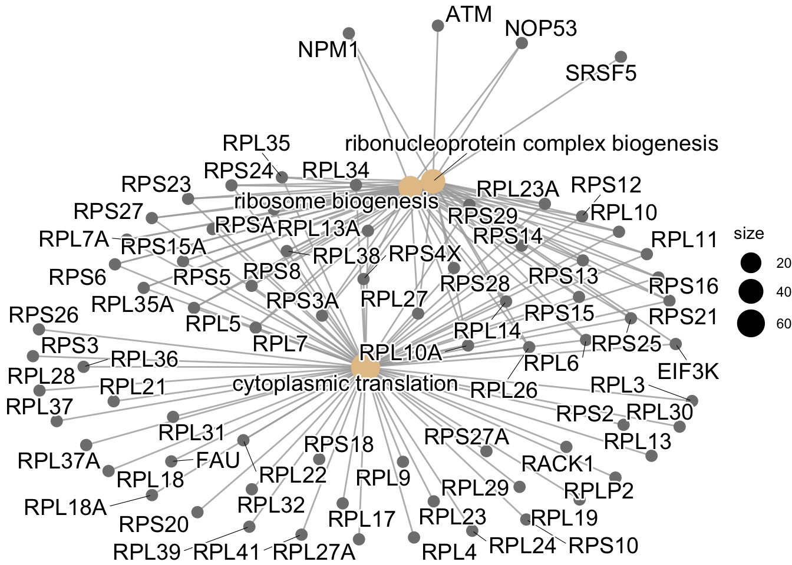

```r
barplot(Cluster8.ego, showCategory=10, 
        title="GO Enrichment Analysis for Cluster 8")
```
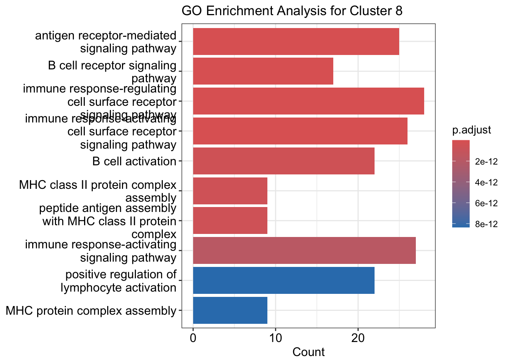

```r
p_cluster8 <- dotplot(Cluster8.ego, showCategory=20, 
        title="GO Enrichment Analysis for Cluster 8")
p_cluster8 + theme(axis.text.y = element_text(size = 3))
```
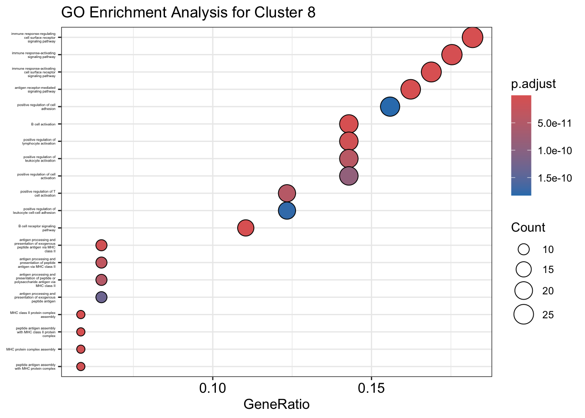

```r
Cluster8.ego <- pairwise_termsim(Cluster8.ego)
emapplot(Cluster8.ego, showCategory=20)
```
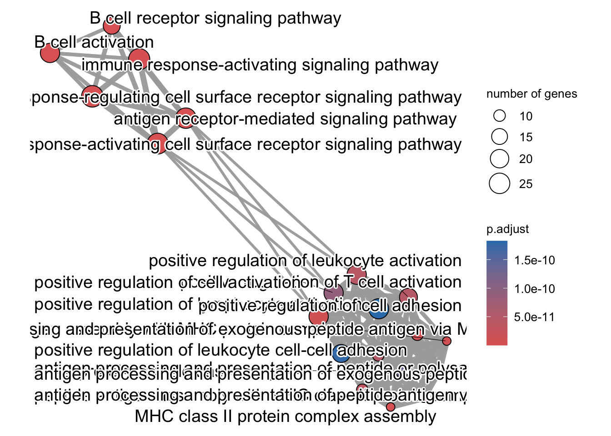

```r
cnetplot(Cluster8.ego, categorySize="pvalue", 
         foldChange=Cluster8.gene_ids$ENTREZID, showCategory = 3)

## Warning in cnetplot.enrichResult(x, ...): Use 'color.params = list(foldChange = your_value)' instead of 'foldChange'.
##  The foldChange parameter will be removed in the next version.
```
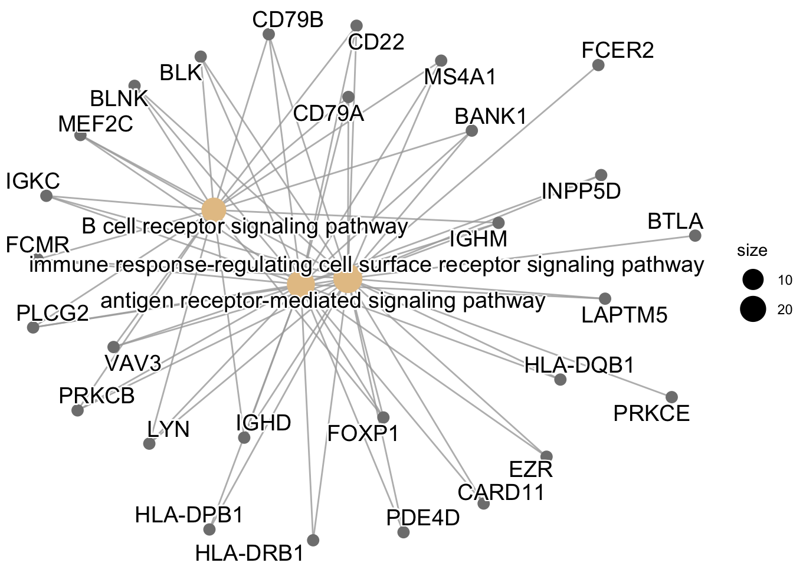

!!! question "Discussion"
    - What are the differences between the three clusters?
    - Which plots are most informative for you?
    - What are the most interesting GO terms you found?

## Perform gene ontology analysis for all clusters

We have completed gene ontology analysis for each cluster. But we can also perform
gene ontology analysis for all clusters together. We can combine all
marker genes from all clusters and do gene ontology analysis for them.

```r
cluster_gene_list <- split(marker.genes.pbmc.rna$gene, marker.genes.pbmc.rna$cluster)

cluster_gene_list <- lapply(cluster_gene_list, function(genes) {
  gene_ids <- bitr(genes, fromType = "SYMBOL", toType = "ENTREZID", OrgDb = org.Hs.eg.db)
  return(gene_ids$ENTREZID)
})

## 'select()' returned 1:1 mapping between keys and columns
## 'select()' returned 1:1 mapping between keys and columns
## 'select()' returned 1:1 mapping between keys and columns
## 'select()' returned 1:1 mapping between keys and columns
## 'select()' returned 1:1 mapping between keys and columns
## 'select()' returned 1:1 mapping between keys and columns
## 'select()' returned 1:1 mapping between keys and columns
## 'select()' returned 1:1 mapping between keys and columns
## 'select()' returned 1:1 mapping between keys and columns
## 'select()' returned 1:1 mapping between keys and columns
## 'select()' returned 1:1 mapping between keys and columns
## 'select()' returned 1:1 mapping between keys and columns
## 'select()' returned 1:1 mapping between keys and columns
## 'select()' returned 1:1 mapping between keys and columns
## 'select()' returned 1:1 mapping between keys and columns
## 'select()' returned 1:many mapping between keys and columns
## 'select()' returned 1:1 mapping between keys and columns
```

We can use the `compareCluster()` function from `clusterProfiler`
package to perform gene ontology analysis for all clusters together.

```r
# GO enrichment analysis for BP
go_compare_bp <- compareCluster(geneCluster = cluster_gene_list, 
                             fun = "enrichGO", 
                             OrgDb = org.Hs.eg.db, 
                             ont = "BP",  # "BP"、"MF" or "CC"
                             pAdjustMethod = "BH",
                             pvalueCutoff = 0.05,
                             qvalueCutoff = 0.05)
```

### Visualise the GO enrichment results for all clusters

A dot plot is a good way to visualise the GO enrichment results for all
clusters. It can show you the proportion of overlap and p-value for each
GO term, for all clusters in a single plot.

```r
cluster.p1 <- dotplot(go_compare_bp, showCategory = 1,
              title = "GO Enrichment (Biological Process)")
cluster.p1 + theme(axis.text.y = element_text(size = 5))
```
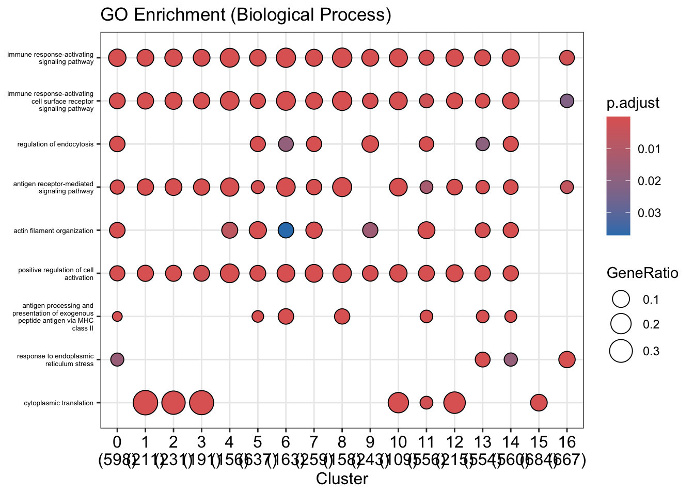

But dot plots are not good for showing the relationship between GO terms.
We can select and cluster GO terms first, and then use a tree plot to
show the correlations between GO terms.

```r
trim_bp <- pairwise_termsim(go_compare_bp, showCategory = 50)
treeplot(trim_bp, showCategory = 5)

## Scale for fill is already present.
## Adding another scale for fill, which will replace the existing scale.
## Warning in (function (..., type = getOption("ggplot2.continuous.fill")) : log-10 transformation introduced infinite values.
## log-10 transformation introduced infinite values.
```

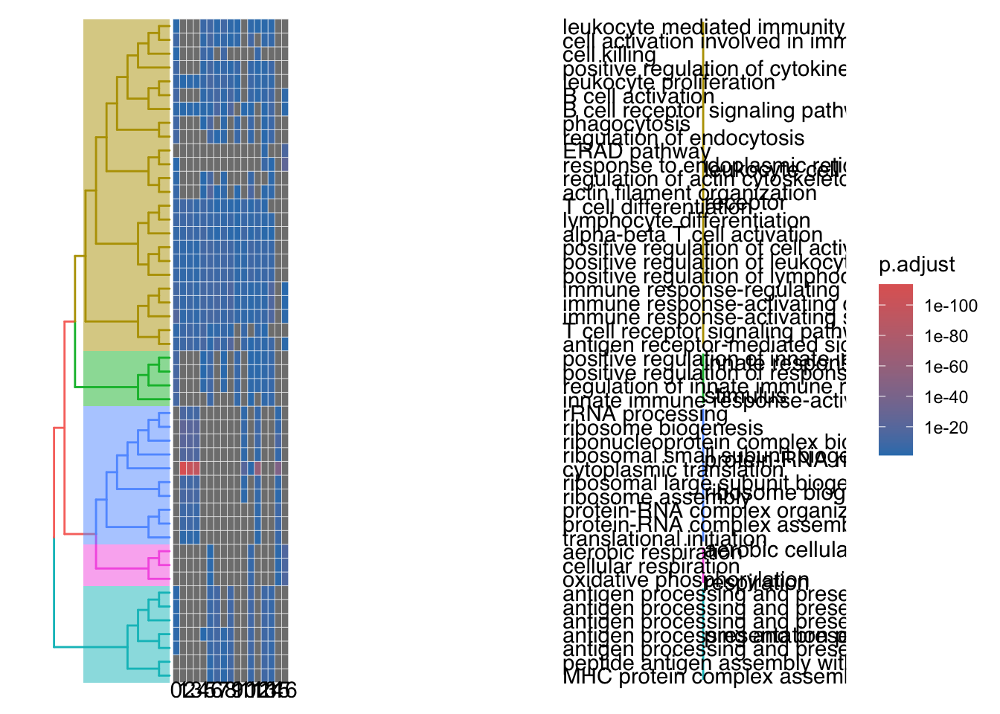

!!! question "Challenge"
    Perform GO enrichment analysis for other two ontologies.
    ??? info "Solution"
        ```r
        # GO enrichment analysis for CC
        go_compare_cc <- compareCluster(geneCluster = cluster_gene_list, 
                                    fun = "enrichGO", 
                                    OrgDb = org.Hs.eg.db, 
                                    ont = "CC",  # "BP"、"MF" or "CC"
                                    pAdjustMethod = "BH",
                                    pvalueCutoff = 0.05,
                                    qvalueCutoff = 0.05)

        # GO enrichment analysis for MF
        go_compare_mf <- compareCluster(geneCluster = cluster_gene_list, 
                                    fun = "enrichGO", 
                                    OrgDb = org.Hs.eg.db, 
                                    ont = "MF",  # "BP"、"MF" or "CC"
                                    pAdjustMethod = "BH",
                                    pvalueCutoff = 0.05,
                                    qvalueCutoff = 0.05)
        ```

### Visualise GO enrichment results for other two ontology categories

```r
cluster.p2 <- dotplot(go_compare_cc, showCategory = 1,
              title = "GO Enrichment (Cellular Component)")

cluster.p2 + theme(axis.text.y = element_text(size = 5))
```
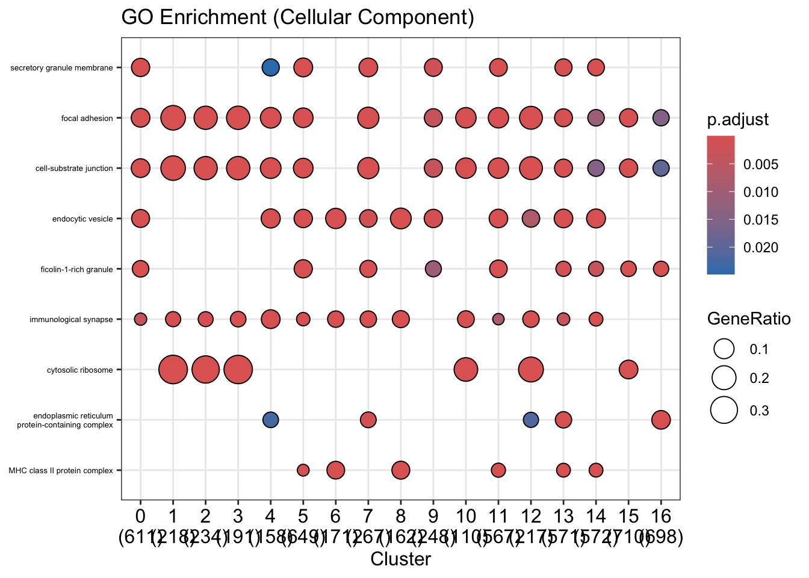

```r
trim_cc <- pairwise_termsim(go_compare_cc, showCategory = 50)
treeplot(trim_cc, showCategory = 5)
```
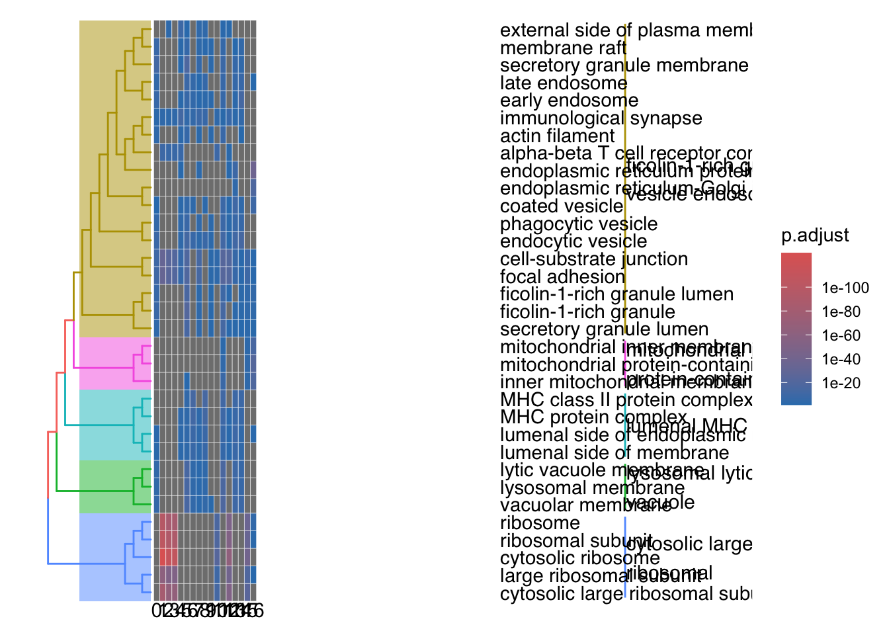

```r
cluster.p3 <- dotplot(go_compare_mf, showCategory = 1,
              title = "GO Enrichment (Molecular Function)")
cluster.p3 + theme(axis.text.y = element_text(size = 5))
```
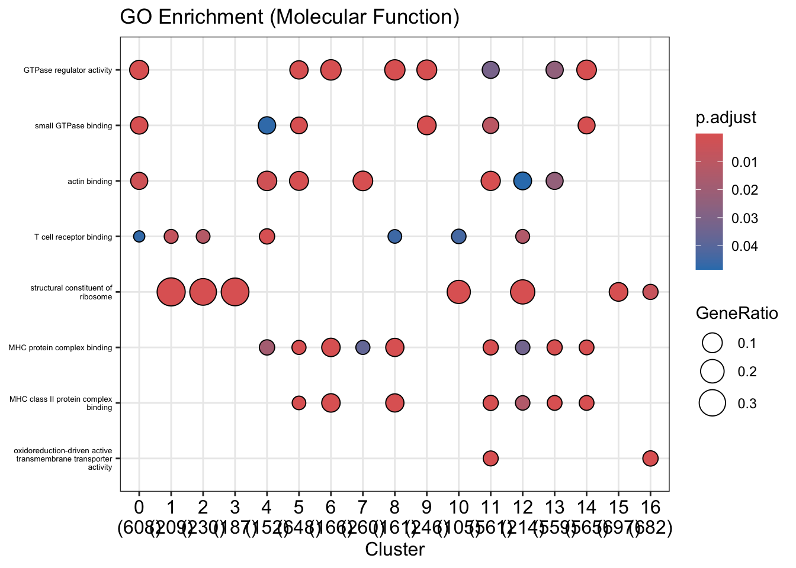

```r
trim_mf <- pairwise_termsim(go_compare_mf, showCategory = 50)
treeplot(trim_mf, showCategory = 5)
```
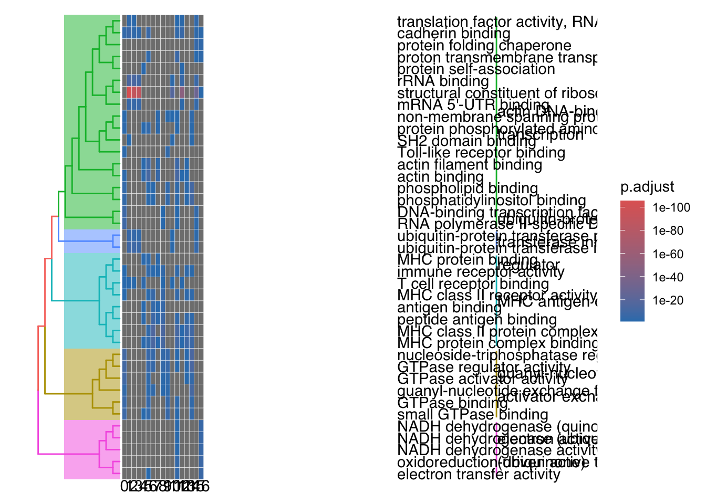

## Integrate ATAC-seq data with single-cell RNA-seq data (N Integration)

From the gene ontology analysis, we found that the three clusters have
different biological functions. But we still don't know why they have
different functions. One possible reason is that they have different
gene activity. We can use the ATAC-seq data to quantify the gene
activity and integrate the ATAC-seq data with the single-cell RNA-seq
data to explain the differences.

### QC for ATAC-seq data (already performed and saved in the dataset)

Similar to the RNA data, we have completed the QC for the ATAC-seq data
and applied the label "filtered". We move forward by 
selecting only cells that are not labelled 'filtered'.

```r
pbmc.atac <- subset(pbmc.atac, seurat_annotations != "filtered")
```

### Preprocess ATAC-seq data

We will perform the standard Seurat pipeline for single-cell ATAC analysis.
We will normalise the data, find top features, run SVD, and run UMAP.
See `Signac` (also provided by Satija's group) tutorial for more
details.

```r
# Add gene annotation information
annotations <- GetGRangesFromEnsDb(ensdb = EnsDb.Hsapiens.v86)
seqlevelsStyle(annotations) <- "UCSC"
genome(annotations) <- "hg38"
Annotation(pbmc.atac) <- annotations

# We exclude the first dimension as this is typically correlated with sequencing depth
pbmc.atac <- RunTFIDF(pbmc.atac)

## Performing TF-IDF normalisation

pbmc.atac <- FindTopFeatures(pbmc.atac, min.cutoff = "q0")
pbmc.atac <- RunSVD(pbmc.atac)

## Running SVD
## Scaling cell embeddings

pbmc.atac <- RunUMAP(pbmc.atac, reduction = "lsi", dims = 2:30, 
                     reduction.name = "umap.atac", reduction.key = "atacUMAP_")

## 11:52:35 UMAP embedding parameters a = 0.9922 b = 1.112
## 11:52:36 Read 10412 rows and found 29 numeric columns
## 11:52:36 Using Annoy for neighbor search, n_neighbors = 30
## 11:52:36 Building Annoy index with metric = cosine, n_trees = 50
## 0%   10   20   30   40   50   60   70   80   90   100%
## [----|----|----|----|----|----|----|----|----|----|
## **************************************************|
## 11:52:36 Writing NN index file to temp file /var/folders/pv/fvynh7953flggrfb49p2lqsc0000gn/T//RtmpuPPPuo/file4dc37680c360
## 11:52:36 Searching Annoy index using 1 thread, search_k = 3000
## 11:52:38 Annoy recall = 100%
## 11:52:39 Commencing smooth kNN distance calibration using 1 thread with target n_neighbors = 30
## 11:52:40 Initializing from normalized Laplacian + noise (using RSpectra)
## 11:52:40 Commencing optimization for 200 epochs, with 414208 positive edges
## 11:52:43 Optimization finished
```

### Visualise the ATAC-seq data with scRNA-seq data

Next, we want a side-by-side overview of the single-cell ATAC-seq 
and RNA-seq datasets.

```r
# Visualise two datasets together
p1 <- DimPlot(pbmc.rna, group.by = "seurat_clusters", label = TRUE) + NoLegend() + ggtitle("RNA")
p2 <- DimPlot(pbmc.atac, group.by = "orig.ident", label = FALSE) + NoLegend() + ggtitle("ATAC")
p1 + p2
```
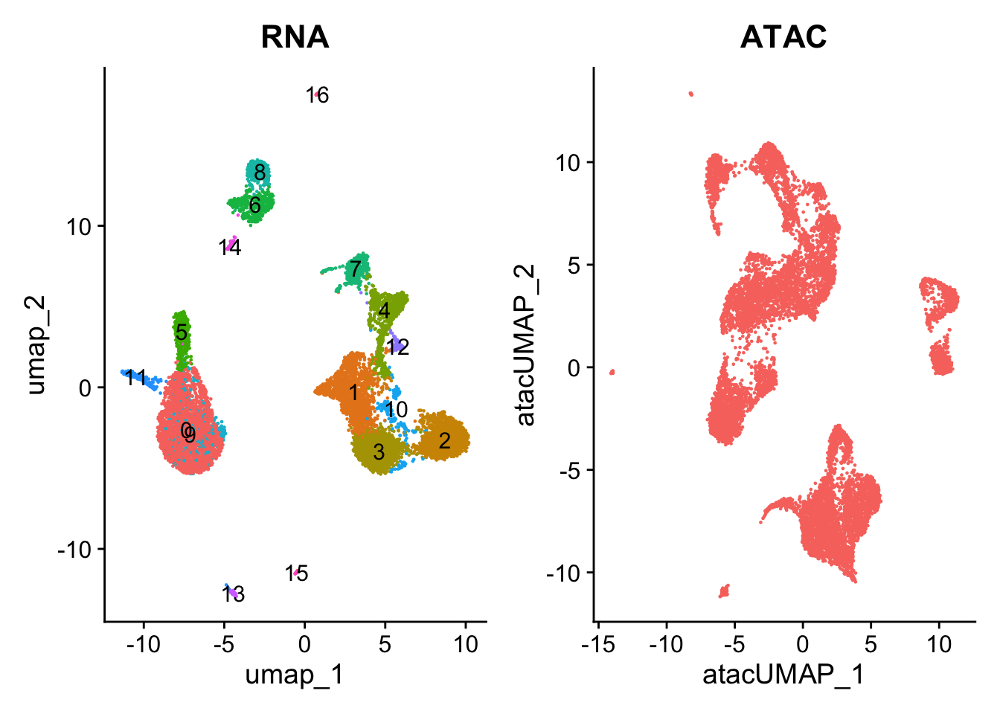

From the visualisation, we have the clustering information from the RNA
data, but we know nothing about the ATAC data.

We can see that the two datasets have different clustering patterns. We
will integrate the two datasets to explain the ATAC-seq clusters.

### Quantify gene activity

Before we integrate the two datasets, we need to quantify the gene
activity from the ATAC-seq data. We will use the `GeneActivity()`
function from `Signac` package to quantify the gene activity.

```r
# quantify gene activity
gene.activities <- GeneActivity(pbmc.atac, features = VariableFeatures(pbmc.rna))

## Extracting gene coordinates
## Extracting reads overlapping genomic regions

# add gene activities as a new assay
pbmc.atac[["ACTIVITY"]] <- CreateAssayObject(counts = gene.activities)

# normalise gene activities
DefaultAssay(pbmc.atac) <- "ACTIVITY"
pbmc.atac <- NormalizeData(pbmc.atac)
pbmc.atac <- ScaleData(pbmc.atac, features = rownames(pbmc.atac))

## Centering and scaling data matrix
```

### Integrate RNA-seq data with ATAC-seq data

Similar to integrating two RNA-seq data, we will use the
`FindTransferAnchors()` function from the Seurat package to integrate the
RNA-seq data with the ATAC-seq data. We will use the CCA method to
integrate the two datasets. Then, we can transfer the clustering
information from the RNA-seq data to the ATAC-seq data.

```r
# Identify anchors
transfer.anchors <- FindTransferAnchors(reference = pbmc.rna, query = pbmc.atac, features = VariableFeatures(object = pbmc.rna),
                                        reference.assay = "RNA", query.assay = "ACTIVITY", reduction = "cca")

## Warning: 714 features of the features specified were not present in both the reference query assays. 
## Continuing with remaining 1286 features.
## Running CCA
## Merging objects
## Finding neighborhoods
## Finding anchors
##  Found 23956 anchors

cluster.predictions <- TransferData(anchorset = transfer.anchors, refdata = pbmc.rna$seurat_clusters,
                                     weight.reduction = pbmc.atac[["lsi"]], dims = 2:30)

## Finding integration vectors
## Finding integration vector weights
## Predicting cell labels

pbmc.atac <- AddMetaData(pbmc.atac, metadata = cluster.predictions)
```

### Visualise the integrated data

We are now able to visualise the integrated data. We can see the
predicted cluster annotation of the scATAC-seq data on the UMAP plot.

```r
# Visualise the integrated data
DimPlot(pbmc.atac, group.by = "predicted.id", label = TRUE) + NoLegend() + ggtitle("Predicted clusters annotation")
```
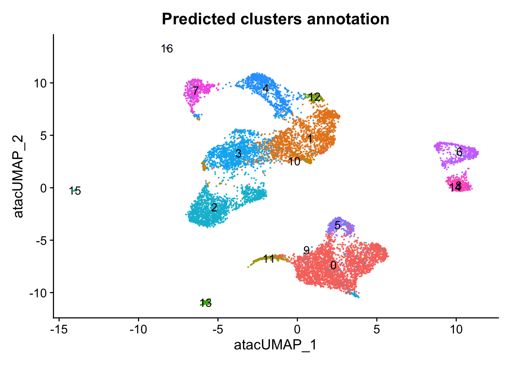

### Visualise the ATAC-seq regions around a gene of interest

We can also visualise the ATAC-seq regions around a gene of interest. We
will use two marker genes of T cells (CD4 and CD8). We can see the
ATAC-seq regions around the CD4 and CD8A genes differ for different cell types.

```r
DefaultAssay(pbmc.atac) <- "ATAC"
Idents(pbmc.atac) <- "predicted.id"
CoveragePlot(
  pbmc.atac, region = "CD4", group.by = "predicted.id",
  idents = c("2", "3", "8"),
  extend.downstream = 5000, extend.upstream = 5000)

## Warning: Removed 10 rows containing missing values or values outside the scale range
## (`geom_segment()`).
```
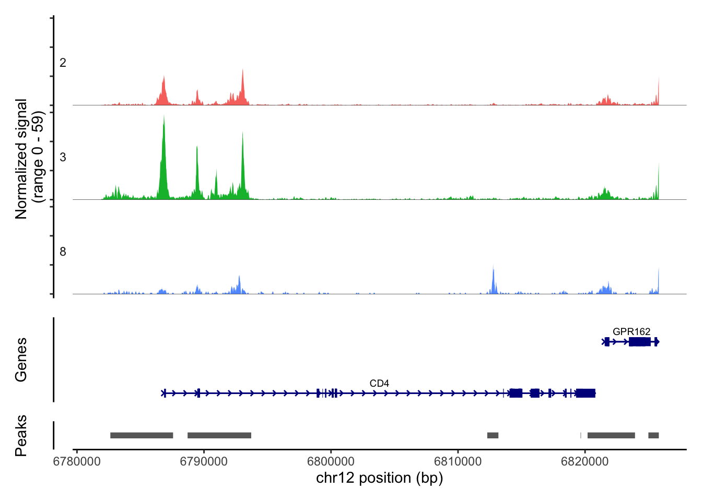

```r
DefaultAssay(pbmc.atac) <- "ATAC"
Idents(pbmc.atac) <- "predicted.id"
CoveragePlot(
  pbmc.atac, region = "CD8A", group.by = "predicted.id",
  idents = c("2", "3", "8"),
  extend.downstream = 5000, extend.upstream = 5000)
```
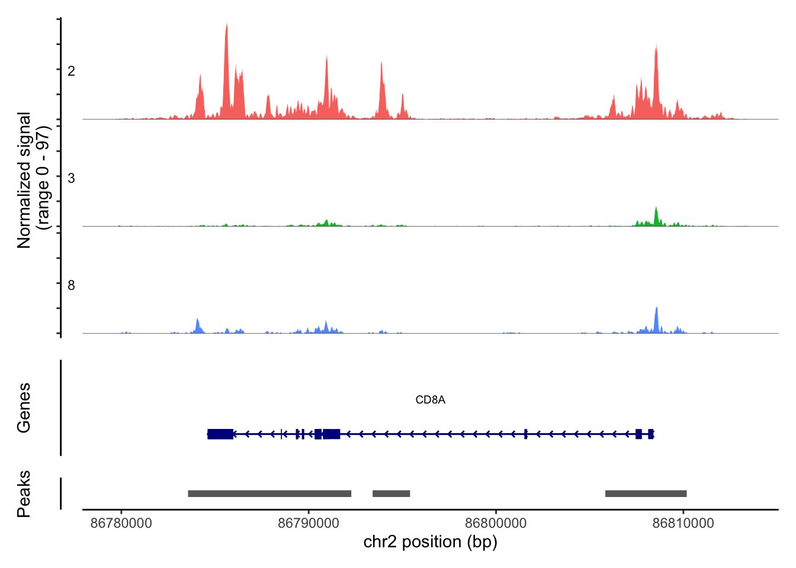

### Additional benchmark study: Evaluate the accuracy of the integrated data

We predicted the cell-type labels for the scATAC-seq data from the
scRNA-seq data. So, it is useful to know how accurate the predictions are. We can
evaluate the accuracy of the integrated data by comparing the predicted
labels with the ground-truth labels.

```r
celltype.predictions <- TransferData(anchorset = transfer.anchors, refdata = pbmc.rna$seurat_annotations,
                                     weight.reduction = pbmc.atac[["lsi"]], dims = 2:30)

## Finding integration vectors
## Finding integration vector weights
## Predicting cell labels

pbmc.atac <- AddMetaData(pbmc.atac, metadata = celltype.predictions)
```

```r
# Visualise the integrated data
pbmc.atac$annotation_correct <- pbmc.atac$predicted.id == pbmc.atac$seurat_annotations
p1 <- DimPlot(pbmc.atac, group.by = "predicted.id", label = TRUE) + NoLegend() + ggtitle("Predicted annotation")
p2 <- DimPlot(pbmc.atac, group.by = "seurat_annotations", label = TRUE) + NoLegend() + ggtitle("Ground-truth annotation")
p1 | p2
```


```r
DefaultAssay(pbmc.atac) <- "ATAC"
Idents(pbmc.atac) <- "predicted.id"
CoveragePlot(
  pbmc.atac, region = "CD4", group.by = "predicted.id",
  idents = c("CD8 Naive", "CD8 TEM_1", "CD8 TEM_2", "CD4 Naive", "CD4 TCM", "CD4 TEM"),
  extend.downstream = 5000, extend.upstream = 5000)

## Warning: Removed 10 rows containing missing values or values outside the scale range
## (`geom_segment()`).
```
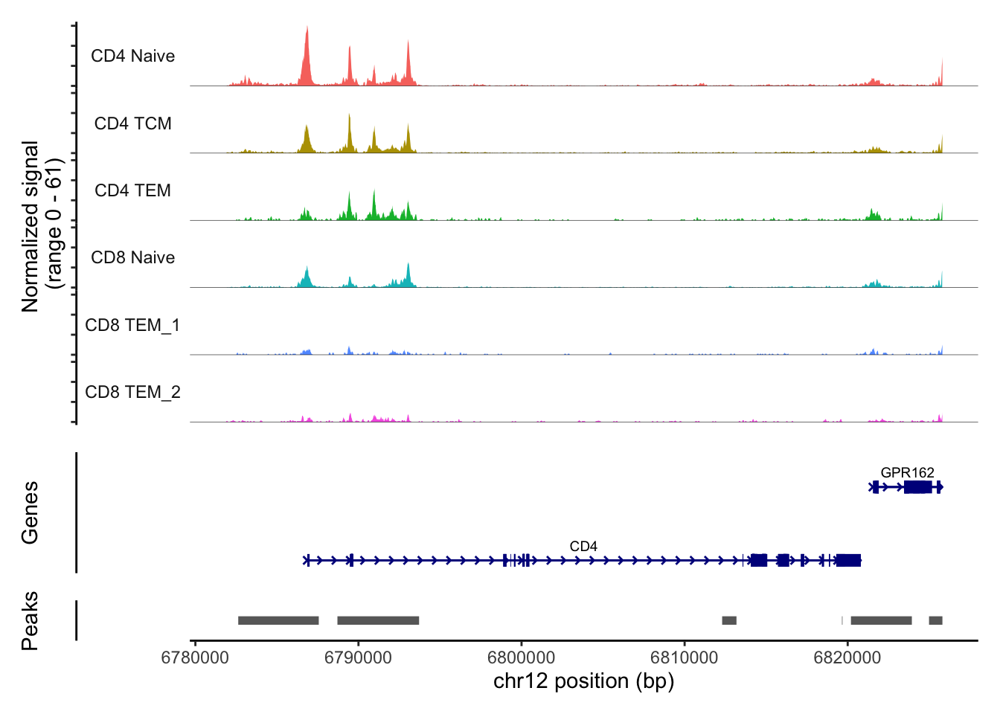


```r
CoveragePlot(
  pbmc.atac, region = "CD8A", group.by = "predicted.id",
  idents = c("CD8 Naive", "CD8 TEM_1", "CD8 TEM_2", "CD4 Naive", "CD4 TCM", "CD4 TEM"),
  extend.downstream = 5000, extend.upstream = 5000)
```
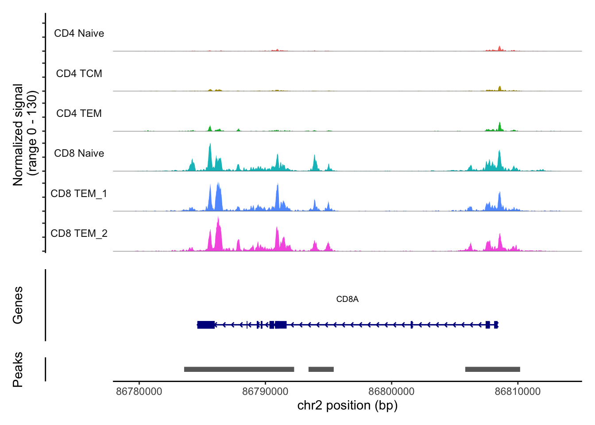

Overall, the visualisation of the integrated data shows that the
predicted labels are consistent with the ground-truth labels. The
coverage plots also show that the ATAC-seq regions around the CD4 and
CD8A genes are different for different cell types.

We can also use some quantitative metrics to evaluate the accuracy of
the integrated data. We can calculate the accuracy of the predicted
labels by comparing them with the ground-truth labels.

```r
# Evaluate the accuracy of the integrated data
predictions <- table(pbmc.atac$seurat_annotations, pbmc.atac$predicted.id)
predictions <- predictions/rowSums(predictions)  # normalize for number of cells in each cell type
predictions <- as.data.frame(predictions)
p1 <- ggplot(predictions, aes(Var1, Var2, fill = Freq)) + geom_tile() + scale_fill_gradient(name = "Fraction of cells",
                                                                                            low = "#ffffc8", high = "#7d0025") + xlab("Cell type annotation (RNA)") + ylab("Predicted cell type label (ATAC)") +
  theme_cowplot() + theme(axis.text.x = element_text(angle = 90, vjust = 0.5, hjust = 1))

correct <- length(which(pbmc.atac$seurat_annotations == pbmc.atac$predicted.id))
incorrect <- length(which(pbmc.atac$seurat_annotations != pbmc.atac$predicted.id))
data <- FetchData(pbmc.atac, vars = c("prediction.score.max", "annotation_correct"))
p1
```
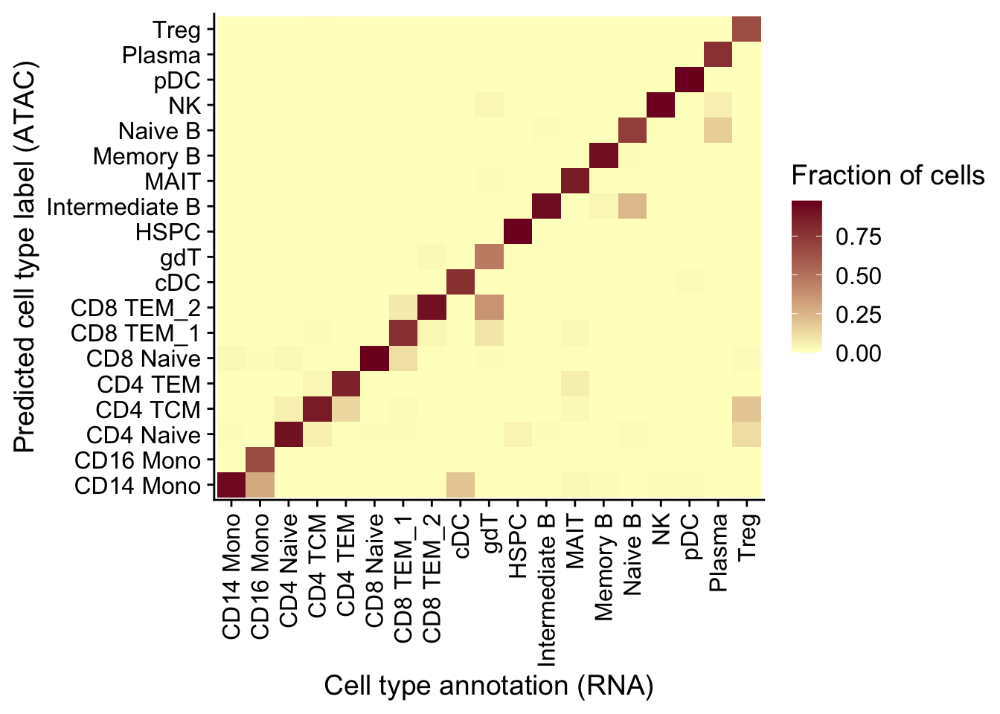

```r
p2 <- ggplot(data, aes(prediction.score.max, fill = annotation_correct, colour = annotation_correct)) +
  geom_density(alpha = 0.5) + theme_cowplot() + scale_fill_discrete(name = "Annotation Correct",
                                                                    labels = c(paste0("FALSE (n = ", incorrect, ")"), paste0("TRUE (n = ", correct, ")"))) + scale_color_discrete(name ="Annotation Correct",
                                                                                                                                                                                  labels = c(paste0("FALSE (n = ", incorrect, ")"), paste0("TRUE (n = ", correct, ")"))) + xlab("Prediction Score")

p2
```


In this example, annotations for an scATAC-seq profile are correctly
predicted via scRNA-seq integration \~90% of the time. In addition, the
prediction.score.max field quantifies the uncertainty associated with
our predicted annotations. We can see that cells that are correctly
annotated are typically associated with high prediction scores (\>90%),
while cells that are incorrectly annotated are associated with sharply
lower prediction scores (<50%). Incorrect assignments also tend to
reflect closely related cell types (i.e. Intermediate vs. Naive B
cells).

<!--
## Glossary

A glossary at the end of the page is always helpful. This way you can refer to [terms](./template.md#glossary) throughout the lesson.

**Terms:** are written in bold in the glossary.
-->