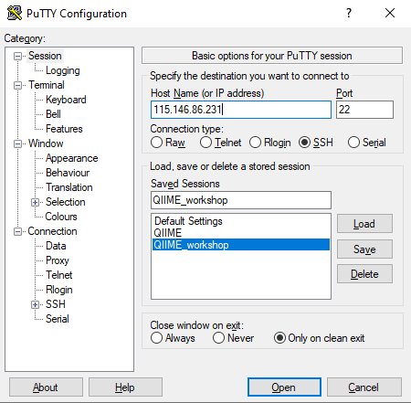

{: style="width:350px; padding-right:50px"}       {: style="width:150px"}

# Workshops using Nectar Instances

The workshop you will be doing will run on a [Nectar](https://cloud.nectar.org.au/) Instance. An “Instance” is Nectar terminology for a virtual machine running on the Nectar Cloud OpenStack infrastructure. An “Instance” runs on a “compute node”; i.e. a physical computer populated with processor chips, memory chips and so on.


---------------------
## Required Software

**Mac Users:** No additional software needs to be installed for this workshop. You will use the `Terminal` app. Files can be transferred between your local computer and the remote Nectar Instance using `scp`. If you are a novice on the command line, software for transferring files such as [FileZilla](https://filezilla-project.org/) or [Cyberduck](https://cyberduck.io/) can be used.

**Windows Users:**  
1. A terminal emulator such as [PuTTY](https://www.chiark.greenend.org.uk/~sgtatham/putty/latest.html) (free and open-source) will need to be downloaded.  
2. Software for file transfers between a local computer and remote server such as [FileZilla](https://filezilla-project.org/) or [WinSCP](https://winscp.net/eng/index.php) is required.  


--------------
## Logging on to a Nectar Instance

You will be given an individual username, IP address and password to log on to using the SSH client tool on your computer (Terminal on Mac or PuTTY on Windows).

**Host:** The IP address of the Nectar instance  
**Username:** alpha | beta | gamma | delta | epsilon | zeta  
**Port:** 22  
**Password:** *Password that has been given to you.*

!!! attention
    Follow the instructions for your operating system carefully.

    Repeated failed login attempt might result in being locked out of the account.

<br>
**Mac Users:**

In *Terminal*, type:

```bash
ssh username@nectar_ip-address
```

You will be prompted to enter your password. After you have entered your password, hit `return`.

??? example "Mac Terminal Example"
    

??? question "I can't see my password as I'm typing it"
    You won't receive feedback when entering your password. Rest assured it is being entered as you type it (or paste it in). Hit `return` after you have typed the whole password.

**Windows Users:**

In *PuTTY*, enter the IP address as the host name and 22 for the port.

After you click "Open" you'll be prompted to type the username you have been assigned (i.e. alpha | beta | gamma | delta | epsilon | zeta). Press `enter`. You will then be prompted for the password that has been given to you. Press `enter`.

??? example "Putty Example"
    

??? question "I can't see my password as I'm typing it"
    You won't receive feedback when entering your password. Rest assured it is being entered as you type it (or paste it in). Hit `enter` after you have typed the whole password.

??? question "How can I use copy and paste to enter my password?"
    *PuTTY* has a different shortcut for paste compared to what you may be used to. Instead of `ctrl-v`, try right-clicking in the password field to paste the contents of your clipboard.

--------------
## Transferring files between your computer and Nectar Instance

**Host:** The IP address of the Nectar instance  
**Username:** alpha | beta | gamma | delta | epsilon | zeta  
**Port:** 22  
**Password:** *Password that has been given to you.*


**Mac Users**

`scp` can be used to transfer files. Alternatively, novice Unix users may want to use [FileZilla](https://filezilla-project.org/).

??? example "Filezilla Example"
    


<br>
**Windows Users**  

Using file transfer software such as [FileZilla](https://filezilla-project.org/) or [WinSCP](https://winscp.net/eng/index.php):

??? example "Filezilla Example"
    


--------------------
## Testing your log on

1. [Log on](#logging-on-to-a-nectar-instance) to your Nectar Instance.

2. Get a copy of the `test_transfer.txt` file:  
```bash
cp /mnt/shared_data/test_transfer.txt ~  
```  
3. [Transfer](#transferring-files-between-your-computer-and-nectar-instance) `test_transfer.txt` to your local computer.


----------------
## Byobu-screen

Some of the commands can take a while to run. Should your connection drop and the SSH session on Nectar terminates, any commands that are running will terminate too. To mitigate this, once logged on to the Nectar Instance, we'll run `byobu-screen` (an enhancement for the `screen` terminal multiplexer) which allows us to resume a session. In other words, processes running in `byobu-screen` will continue to run when their window is not visible, even if you get disconnected.


!!! attention
    We will do this step in the workshop though feel free to try out the `byobu-screen` commands below.


### Starting a byobu-screen session.

On Nectar, to start a `byobu-screen` session called `workshop`, type  

```bash
byobu-screen -S workshop
```

??? example "Byobu Example"
    


You can then proceed to run the commands in the workshop as normal.

### Reconnecting to a byobu-screen session.

Should your SSH session on Nectar terminate, once you log back in to your Nectar instance, list running sessions/screens:

```bash
byobu-screen -ls
```

If it says (Detached) next to the `workshop` session in the list, reattach to `workshop` by:

```bash
byobu-screen -r workshop
```

If it says (Attached) next to the `workshop` session in the list, you can access `workshop` which is already attached by:

```bash
byobu-screen -r -d workshop
```


### Detaching or Terminating a byobu-screen session.

* To detach from `workshop`, type `ctrl-a ctrl-d` while inside the `workshop` session.
(You will need to configure Byobu's ctrl-a behaviour if it hasn't already been configured (text will appear on the screen telling you this). Follow the information on the screen and select `1` for Screen mode).

* To terminate `workshop`, type `ctrl-d` while inside the `workshop` session.


--------------
## Applying for your own Nectar Allocation
Should you wish to do this tutorial at a later stage independently, it is possible to apply for your own instance directly through a [Nectar allocation](https://support.ehelp.edu.au/support/solutions/articles/6000068044-managing-an-allocation). There are also many helpful [Nectar Research Cloud tutorials](https://tutorials.rc.nectar.org.au/). You will need to install your required software.
